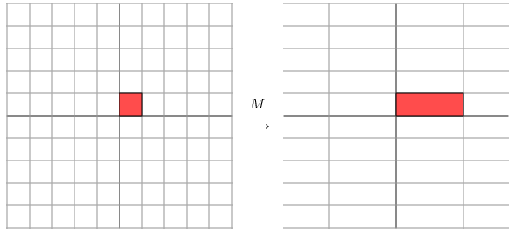
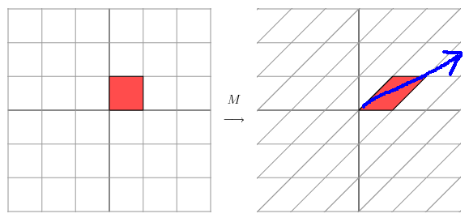
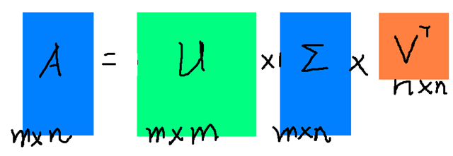

### 一、概述
    在学习机器学习过程中，遇到了很多数学公式以及理论，使得学习机器学习的过程变得无比艰辛，故把机器学习中涉及的一些数学理论，方法整理出来，以供日后查阅。涉及的知识包括：概率论，线性代数，数值分析，最优化等。

### 二、线性代数
#### 2.1 标量，向量，矩阵，张量，正定矩阵
**标量**(scalar)   

 一个标量就是一个单独的数，一般用小写的的变量名称表示。

**向量**(vector)      一个向量就是一列数，这些数是有序排列的。用过次序中的索引，我们可以确定每个单独的数。通常会赋予向量粗体的小写名称。

**矩阵**  (Matrix)   

矩阵是二维数组，其中的每一个元素被两个索引而非一个所确定。我们通常会赋予矩阵粗体的大写变量名称，比如A。 如果一个实数矩阵高度为m，宽度为n，那么我们说**![[公式]](https://www.zhihu.com/equation?tex=A%5Cepsilon+R%5E%7Bm%5Ctimes+n%7D+)。**

**张量**（tensor）

几何代数中定义的张量是基于向量和矩阵的推广,通俗一点理解的话,我们可以将标量视为零阶张量,矢量视为一阶张量，那么矩阵就是二阶张量。

例如，可以将任意一张彩色图片表示成一个三阶张量，三个维度分别是图片的高度、宽度和色彩数据。

张量在深度学习中是一个很重要的概念，因为它是一个深度学习框架中的一个核心组件，后续的所有运算和优化算法几乎都是基于张量进行的。

**正定矩阵**


#### 2.2 范数

有时我们需要衡量一个向量的大小。在机器学习中，我们经常使用被称为范数(norm) 的函数衡量矩阵大小。Lp 范数如下：

![[公式]](https://www.zhihu.com/equation?tex=%5Cleft%7C+%5Cleft%7C+x+%5Cright%7C+%5Cright%7C+_%7Bp%7D%5E%7B%7D+%3D%5Cleft%28+%5Csum_%7Bi%7D%5E%7B%7D%7B%5Cleft%7C+x_%7Bi%7D+%5Cright%7C+%5E%7Bp%7D+%7D+%5Cright%29+_%7B%7D%5E%7B%5Cfrac%7B1%7D%7Bp%7D+%7D+)

所以：

L1范数![[公式]](https://www.zhihu.com/equation?tex=%5Cleft%7C+%5Cleft%7C+x+%5Cright%7C+%5Cright%7C+)：为x向量各个元素绝对值之和；

L2范数![[公式]](https://www.zhihu.com/equation?tex=%5Cleft%7C+%5Cleft%7C+x+%5Cright%7C+%5Cright%7C+_%7B2%7D+)：为x向量各个元素平方和的开方。

这里先说明一下，在机器学习中，L1范数和L2范数很常见，主要用在损失函数中起到一个限制模型参数复杂度的作用，至于为什么要限制模型的复杂度，这又涉及到机器学习中常见的过拟合问题。

#### 2.3 特征分解

首先回顾下特征值和特征向量的定义如下：

​													Aν=λν

其中  A 是一个 ![[公式]](https://www.zhihu.com/equation?tex=n%5Ctimes+n) 矩阵， ν 是一个 ![[公式]](https://www.zhihu.com/equation?tex=n) 维向量，则 λ 是矩阵 A 的一个特征值，而 ν 是矩阵 A 的特征值 λ 所对应的特征向量。

**矩阵特征值是对特征向量进行伸缩和旋转程度的度量**，实数是只进行伸缩，虚数是只进行旋转，复数就是有伸缩有旋转。

一个**实对称矩阵**的一组特征向量是一组正交向量。特征值分解是将一个矩阵分解成下面的形式：

A=QΣQ−1

其中Q是这个矩阵A的特征向量组成的矩阵，Σ是一个对角阵，每一个对角线上的元素就是一个特征值。我这里引用了一些参考文献中的内容来说明一下。首先，要明确的是，一个矩阵其实就是一个线性变换，因为一个矩阵乘以一个向量后得到的向量，其实就相当于将这个向量进行了线性变换。比如说下面的一个矩阵：
$$
M = \left[ \matrix{  3 & 0  \\  0 & 1 } \right]
$$
它其实对应的线性变换是下面的形式：



因为这个矩阵M乘以一个向量(x,y)的结果是：
$$
\left[\matrix{3 & 0 \\ 0 & 1}\right]\left[\matrix{x \\ y}\right] = \left[\matrix{3x \\ y}\right]
$$
它所描述的变换是下面的样子：



这其实是在平面上对一个轴进行的拉伸变换（如蓝色的箭头所示），在图中，蓝色的箭头是一个最**主要的**变化方向（变化方向可能有不止一个），**如果我们想要描述好一个变换，那我们就描述好这个变换主要的变化方向就好了**。反过头来看看之前特征值分解的式子，分解得到的Σ矩阵是一个对角阵，里面的特征值是由大到小排列的，**这些特征值所对应的特征向量就是描述这个矩阵变化方向（从主要的变化到次要的变化排列）**

当矩阵是高维的情况下，那么这个矩阵就是高维空间下的一个线性变换，这个线性变化可能没法通过图片来表示，但是可以想象，这个变换也同样有很多的变换方向，我们通过特征值分解得到的前N个特征向量，那么就对应了这个矩阵最主要的N个变化方向。我们利用这前N个变化方向，就可以近似这个矩阵（变换）。也就是之前说的：**提取这个矩阵最重要的特征。**总结一下，特征值分解可以得到特征值与特征向量，特征值表示的是这个特征到底有多重要，而特征向量表示这个特征是什么，可以将每一个特征向量理解为一个线性的子空间，我们可以利用这些线性的子空间干很多的事情。不过，**特征值分解也有很多的局限，比如说变换的矩阵必须是方阵。**


#### 2.4  奇异值分解

特征值分解是一个提取矩阵特征很不错的方法，但是它只是对方阵而言的.**我们怎样才能描述这样普通的矩阵呢的重要特征呢？**奇异值分解可以用来干这个事情，**奇异值分解是一个能适用于任意的矩阵的一种分解的方法**：

假设A是一个M*N的矩阵，那么得到的U是一个M*M的方阵（里面的向量是正交的，U里面的向量称为左奇异向量），Σ是一个M*N的矩阵（除了对角线的元素都是0，对角线上的元素称为奇异值），V’(V的转置)是一个N * N的矩阵，里面的向量也是正交的，V里面的向量称为右奇异向量）

那么奇异值和特征值是怎么对应起来的呢？首先，我们将一个矩阵A的转置 * A，将会得到一个方阵，我们用这个方阵求特征值可以得到：
$$
(A^TA)v_i = \lambda_iv_i
$$
这里得到的v，就是我们上面的右奇异向量。此外我们还可以得到：


这里的σ就是上面说的奇异值，u就是上面说的左奇异向量。奇异值σ跟特征值类似，在矩阵Σ中也是从大到小排列，而且σ的减少特别的快，**在很多情况下，前10%甚至1%的奇异值的和就占了全部的奇异值之和的99%以上了**。也就是说，我们也可以用前r大的奇异值来近似描述矩阵，这里定义一下**部分奇异值分解**：


r是一个远小于m、n的数，这样矩阵的乘法看起来像是下面的样子：


右边的三个矩阵相乘的结果将会是一个接近于A的矩阵，在这儿，r越接近于n，则相乘的结果越接近于A。而这三个矩阵的面积之和（在存储观点来说，矩阵面积越小，存储量就越小）要远远小于原始的矩阵A，我们如果想要**压缩空间来表示原矩阵A**，我们存下这里的三个矩阵：U、Σ、V就好了。

参考:

[特征值分解及奇异值分解的理解]: https://www.rogoso.info/svd/

**在主成分分析,稀疏表示等算法会见到**

#### **2.5  Moore-Penrose伪逆**

对于非方矩阵而言，其逆矩阵没有定义。假设在下面问题中，我们想通过矩阵A的左逆B来求解线性方程：
$$
Ax = y
$$
等式两边同时左乘左逆B后，得到：
$$
x = By
$$
是否存在唯一的映射将A映射到B取决于问题的形式。

如果矩阵A的行数大于列数，那么上述方程可能没有解；如果矩阵A的行数小于列数，那么上述方程可能有多个解。

Moore-Penrose伪逆使我们能够解决这种情况，矩阵A的伪逆定义为：


但是计算伪逆的实际算法没有基于这个式子，而是使用下面的公式：


其中，矩阵U，D 和V 是矩阵A奇异值分解后得到的矩阵。对角矩阵D 的伪逆D+ 是其非零元素取倒之后再转置得到的。

#### 2.6  几种常见的距离

在机器学习里，我们的运算一般都是基于向量的，一条用户具有100个特征，那么他对应的就是一个100维的向量，通过计算两个用户对应向量之间的距离值大小，有时候能反映出这两个用户的相似程度。这在后面的KNN算法和K-means算法中很明显。

设有两个n维变量$A = [x_{12},X_{12},\cdots,x_{1n}]$和$B = [x_{21},x_{22},\cdots,x_{2n}]$，则一些常用的距离公式定义如下：

##### **1、曼哈顿距离**

曼哈顿距离也称为城市街区距离，数学定义如下：
$$
d_{12} = \sum_{k=1}^n|x_{1k}-x_{2k}|
$$

```python
from numpy import *
vector1 = mat([1,2,3])
vector2 = mat([4,5,6])
print sum(abs(vector1-vector2))
```


##### **2、欧氏距离**

欧氏距离其实就是L2范数，数学定义如下：
$$
d_{12} = \sqrt{\sum_{k=1}^n(x_{1k}-x_{2k})^2}
$$

```python
from numpy import *
vector1 = mat([1,2,3])
vector2 = mat([4,5,6])
print sqrt((vector1-vector2)*(vector1-vector2).T)
```


##### **3、闵可夫斯基距离**

从严格意义上讲，闵可夫斯基距离不是一种距离，而是一组距离的定义：
$$
d_{12} = \sqrt[p]{\sum_{k=1}^n(x_{1k}-x_{2k})^p}
$$
实际上，当p=1时，就是曼哈顿距离；当p=2时，就是欧式距离。

##### **4、切比雪夫距离**

$$
d_{12} = max(|x_{1k}-x_{2k}|)
$$

```python
from numpy import *
vector1 = mat([1,2,3])
vector2 = mat([4,5,6])
print sqrt(abs(vector1-vector2).max)
```


##### **5、夹角余弦**

夹角余弦的取值范围为[-1,1]，可以用来衡量两个向量方向的差异；夹角余弦越大，表示两个向量的夹角越小；当两个向量的方向重合时，夹角余弦取最大值1；当两个向量的方向完全相反时，夹角余弦取最小值-1。

机器学习中用这一概念来衡量样本向量之间的差异，其数学表达式如下：
$$
cos\theta = \frac{AB}{|A||B|} = \frac{\sum_{k=1}^{n}x_{1k}x_{2k}}{\sqrt{\sum_{k=1}^nx_{1k}^2}\sqrt{\sum_{k=1}^{n}x^2_{2k}}}
$$

```python
from numpy import *
vector1 = mat([1,2,3])
vector2 = mat([4,5,6])
print dot(vector1,vector2)/(linalg.norm(vector1)*linalg.norm(vector2))
```


##### 6、汉明距离

汉明距离定义的是两个字符串中不相同位数的数目。

例如：字符串‘1111’与‘1001’之间的汉明距离为2。

信息编码中一般应使得编码间的汉明距离尽可能的小。

```python
from numpy import *
matV = mat([1,1,1,1],[1,0,0,1])
smstr = nonzero(matV[0]-matV[1])
print smstr
```


##### **7、杰卡德相似系数**

两个集合A和B的交集元素在A和B的并集中所占的比例称为两个集合的杰卡德相似系数，用符号J(A,B)表示，数学表达式为：
$$
J(A,B) = \frac{|A\and B|}{|A \or B|}
$$
杰卡德相似系数是衡量两个集合的相似度的一种指标。一般可以将其用在衡量样本的相似度上。

##### **8、杰卡德距离**

与杰卡德相似系数相反的概念是杰卡德距离，其定义式为：
$$
J_\sigma = 1-J(A,B)
$$

```python
from numpy import *
import scipy.spatial.distance as dist
matV = mat([1,1,1,1],[1,0,0,1])
print dist.pdist(matV,'jaccard')
```


### 三、概率

#### 3.1  为什么使用概率?

概率论是用于表示不确定性陈述的数学框架,即它是对事物不确定性的度量。

在人工智能领域，我们主要以两种方式来使用概率论。首先，概率法则告诉我们AI系统应该如何推理，所以我们设计一些算法来计算或者近似由概率论导出的表达式。其次，我们可以用概率和统计从理论上分析我们提出的AI系统的行为。

计算机科学的许多分支处理的对象都是完全确定的实体，但机器学习却大量使用概率论。实际上如果你了解机器学习的工作原理你就会觉得这个很正常。因为机器学习大部分时候处理的都是不确定量或随机量。

#### 3.2  随机变量

随机变量可以随机地取不同值的变量。我们通常用小写字母来表示随机变量本身，而用带数字下标的小写字母来表示随机变量能够取到的值。例如，$x_1$和  $x_2$ 都是随机变量X可能的取值。

对于向量值变量，我们会将随机变量写成X，它的一个值为$x$。就其本身而言，一个随机变量只是对可能的状态的描述；它必须伴随着一个概率分布来指定每个状态的可能性。

**随机变量可以是离散的或者连续的**。

#### 3.3  概率分布

给定某随机变量的取值范围，概率分布就是导致该随机事件出现的可能性。

从机器学习的角度来看，概率分布就是符合随机变量取值范围的某个对象属于某个类别或服从某种趋势的可能性。

#### 3.4   条件概率

很多情况下，我们感兴趣的是某个事件在给定其它事件发生时出现的概率，这种概率叫条件概率。

我们将给定$X = x$ 时$Y = y$ 发生的概率记为$P(Y = y|X = x)$，这个概率可以通过下面的公式来计算：
$$
P(Y = y|X = x) = \frac{P(Y = y,X = x)}{P(X = x)}
$$

#### 3.5  贝叶斯公式

先看看什么是“先验概率”和“后验概率”，以一个例子来说明：

假设某种病在人群中的发病率是0.001，即1000人中大概会有1个人得病，则有： **P(患病) = 0.1%**；即：在没有做检验之前，我们预计的患病率为**P(患病)=0.1%**，这个就叫作**"先验概率"**。

再假设现在有一种该病的检测方法，其检测的准确率为**95%**；即：如果真的得了这种病，该检测法有**95%**的概率会检测出阳性，但也有**5%**的概率检测出阴性；或者反过来说，但如果没有得病，采用该方法有**95%**的概率检测出阴性，但也有**5%**的概率检测为阳性。用概率条件概率表示即为：**P(显示阳性|患病)=95%**

现在我们想知道的是：在做完检测显示为阳性后，某人的患病率**P(患病|显示阳性)**，这个其实就称为**"后验概率"。**

而这个叫贝叶斯的人其实就是为我们提供了一种可以**利用先验概率计算后验概率**的方法，我们将其称为**“贝叶斯公式”。**

这里先了解**条件概率公式**：
$$
P(B|A) = \frac{P(AB)}{P(A)},P(A|B)=\frac{P(AB)}{P(B)}
$$
由条件概率可以得到乘法公式:
$$
P(AB) = P(B|A)P(A) = P(A|B)P(B)
$$
将条件概率公式和乘法公式结合得到:
$$
P(B|A)=\frac{P(A|B)*P(B)}{P(A)}
$$
再由全概率公式:
$$
P(A) = 	\sum_{i=1}^NP(A|B_i)P(B_i)
$$
代入可以得到贝叶斯公式:
$$
P(B_i|A) = \frac{P(A|B_i)P(B_i)}{\sum_{i=1}^NP(A|B_i)P(B_i)}
$$
在这个例子里就是:


**贝叶斯公式贯穿了机器学习中随机问题分析的全过程。从文本分类到概率图模型，其基本分类都是贝叶斯公式。**

#### 3.6  期望

在概率论和统计学中，数学期望是试验中每次可能结果的概率乘以其结果的总和。它是最基本的数学特征之一，反映随机变量平均值的大小。

假设X是一个离散随机变量，其可能的取值有：${x_1,x_2,\cdots,x_n}$，各个取值对应的概率取值为：$P(x_k),k=1,2,\cdots,n$    ,  则其数学期望被定义为：
$$
E(X) = \sum_{k=1}^nP(x_k)
$$
假设X是一个连续型随机变量,其概率密度函数为$P(x)$则其数学期望被定义为:
$$
E(x) = \int_{-\infty}^{+\infty}xf(x)dx
$$

#### 3.7  方差

概率中，方差用来衡量随机变量与其数学期望之间的偏离程度；统计中的方差为样本方差，是各个样本数据分别与其平均数之差的平方和的平均数。数学表达式如下：
$$
Var(x) = E\{[x-E(x)]^2\} = E(x^2)-[E(x)]^2
$$

#### 3.8  协方差

在概率论和统计学中，协方差被用于衡量两个随机变量X和Y之间的总体误差。数学定义式为：


#### 3.9  常见分布函数

##### 0-1分布

0-1分布是单个二值型离散随机变量的分布，其概率分布函数为：
$$
P(X=1)=p  \quad    P(X = 0) = 1-p
$$
任何一个只有两种结果的随机现象都服从0-1分布;比如掷硬币,新生儿是男还是女，检查产品是否合格

##### 几何分布

几何分布是离散型概率分布，其定义为：在n次伯努利试验中，试验k次才得到第一次成功的机率。即：前k-1次皆失败，第k次成功的概率。其概率分布函数为：
$$
P(X = k)=(1-p)^{k-1}p
$$
性质:
$$
E(X) = \frac{1}{p} \quad Var(X)=\frac{1-p}{p^2}
$$

##### 二项分布

二项分布即重复n次伯努利试验，各次试验之间都相互独立，并且每次试验中只有两种可能的结果，而且这两种结果发生与否相互对立。如果每次试验时，事件发生的概率为p，不发生的概率为1-p，则n次重复独立试验中发生k次的概率为：
$$
P(X = k)=C_n^kp^k(1-p)^{n-k}
$$
性质:
$$
E(X) = np \quad Var(X) = np(1-p)
$$

##### 泊松分布

日常生活中，大量事件是有固定频率的，比如：

- 某医院平均每小时出生3个婴儿
- 某网站平均每分钟有2次访问
- 某超市平均每小时销售4包奶粉

它们的特点就是，我们可以预估这些事件的总数，但是没法知道具体的发生时间。已知平均每小时出生3个婴儿，请问下一个小时，会出生几个？有可能一下子出生6个，也有可能一个都不出生，这是我们没法知道的。

**泊松分布就是描述某段时间内，事件具体的发生概率。**其概率函数为：
$$
P(N(t)=n) = \frac{(\lambda t)^ne^{-\lambda t}}{n!}
$$
其中：

P表示概率，N表示某种函数关系，t表示时间，n表示数量，1小时内出生3个婴儿的概率，就表示为 P(N(1) = 3) ；$\lambda$ 表示事件的频率.

还是以上面医院平均每小时出生3个婴儿为例，则$\lambda$ = 3;

那么,接下来两个小时,一个婴儿都不出生的概率可以求得为:
$$
P(N(2)=0) = \frac{(3*2)^0*e^{-3.2}}{0!} \approx 0.0025
$$
同理，我们可以求接下来一个小时，至少出生两个婴儿的概率：
$$
P(N(1)\geq 2) =1- P(N(1)=0)-P(N(1)=1) \approx 0.8
$$


##### 指数分布

指数分布是事件的时间间隔的概率，它的一个重要特征是无记忆性。例如：如果某一元件的寿命的寿命为T，已知元件使用了t小时，它总共使用至少t+s小时的条件概率，与从开始使用时算起它使用至少s小时的概率相等。下面这些都属于指数分布：

- 婴儿出生的时间间隔
- 网站访问的时间间隔
- 奶粉销售的时间间隔

指数分布的公式可以从泊松分布推断出来。如果下一个婴儿要间隔时间t，就等同于t之内没有任何婴儿出生，即：
$$
P(X\geq	t) = P(N(t)=0) = \frac{(\lambda t)^0e^{-\lambda t}}{0!}=e^{-\lambda t}
$$
则:
$$
P(X\leq t) = 1-P(X\geq t) = 1-e^{-\lambda t}
$$
如:接下来15分钟,会有婴儿出生的概率为:
$$
P(X\leq \frac{1}{4}) = 1-e^{-3 \frac{1}{4}} \approx 0.53
$$
指数分布的图像如下：


**【注】上面的指数分布和泊松分布参考了阮一峰大牛的博客：“泊松分布和指数分布：10分钟教程”，在此说明，也对其表示感谢！**

##### 高斯分布

高斯分布又叫**正态分布**，其曲线呈钟型，两头低，中间高，左右对称因其曲线呈钟形，如下图所示：


若随机变量X服从一个数学期望为$\mu$，方差为$\sigma$的正态分布，则我们将其记为：$N(\mu,\sigma^2)$。其期望值$\mu$决定了正态分布的位置，其标准差$\sigma$ (方差的开方）决定了正态分布的幅度。

概率密度函数为:


#### 3.10  Lagrange 乘子法

对于一般的求极值问题我们都知道，求导等于0就可以了。但是如果我们不但要求极值，还要求一个满足一定约束条件的极值，那么此时就可以构造Lagrange函数，其实就是**把约束项添加到原函数上，然后对构造的新函数求导**。

对于一个要求极值的函数$f(x,y)$，图上的蓝圈就是这个函数的等高图，就是说 $f(x,y) = c_1,c_2,\cdots,c_n$ 分别代表不同的数值(每个值代表一圈，等高图)，我要找到一组$(x,y)$，使它的$c_i$值越大越好，但是这点必须满足约束条件$g(x,y)$（在黄线上）。


也就是说 $f(x,y)$ 和$g(x,y)$相切,或者说它们的梯度$\nabla f$ 和$\nabla g$ 平行，因此它们的梯度（偏导）成倍数关系；那我么就假设为 $\lambda$ 倍，然后把约束条件加到原函数后再对它求导


更一般地，对含*n*个变量和*k*个约束的情况，有：


在**支持向量机模型（SVM）**的推导中一步很关键的就是利用拉格朗日对偶性将原问题转化为对偶问题。

#### 3.11   最大似然估计

极大似然估计，通俗理解来说，**就是利用已知的样本结果信息，反推最具有可能（最大概率）导致这些样本结果出现的模型参数值！**

**换句话说，极大似然估计提供了一种给定观察数据来评估模型参数的方法，即：“模型已定，参数未知”。**

**极大似然估计中采样需满足一个重要的假设，就是所有的采样都是独立同分布的。**

首先看一下似然函数$p(x|\theta)$  的理解:

对于这个函数：$p(x|\theta)$   输入有两个：x表示某一个具体的数据； ![[公式]](https://www.zhihu.com/equation?tex=%5Ctheta) 表示模型的参数

如果  ![[公式]](https://www.zhihu.com/equation?tex=%5Ctheta) 是已知确定的， x是变量，这个函数叫做概率函数(probability function)，它描述对于不同的样本点  x，其出现概率是多少。

如果 ![[公式]](/img/equation-20191025140034138) 是已知确定的， ![[公式]](/img/equation-20191025140034090) 是变量，这个函数叫做似然函数(likelihood function), 它描述对于不同的模型参数，出现 ![[公式]](/img/equation-20191025140034138) 这个样本点的概率是多少。

这有点像“一菜两吃”的意思。其实这样的形式我们以前也不是没遇到过。例如，$f(x,y)=x^y$ ,即x的y次方。如果x是已知确定的(例如x=2)，这就是$f(y) = 2^y$,这是指数函数。 如果y是已知确定的(例如y=2)，这就是 $f(x) = x^2$ , 这是二次函数。同一个数学形式，从不同的变量角度观察，可以有不同的名字。

举个例子，假如有一个罐子，里面有黑白两种颜色的球，数目多少不知，两种颜色的比例也不知。我 们想知道罐中白球和黑球的比例，但我们不能把罐中的球全部拿出来数。现在我们可以每次任意从已经摇匀的罐中拿一个球出来，记录球的颜色，然后把拿出来的球 再放回罐中。这个过程可以重复，我们可以用记录的球的颜色来估计罐中黑白球的比例。假如在前面的一百次重复记录中，有七十次是白球，请问罐中白球所占的比例最有可能是多少？

**很多人马上就有答案了：70%。而其后的理论支撑是什么呢？**

我们假设罐中白球的比例是p，那么黑球的比例就是1-p。因为每抽一个球出来，在记录颜色之后，我们把抽出的球放回了罐中并摇匀，**所以每次抽出来的球的颜 色服从同一独立分布。**

这里我们把一次抽出来球的颜色称为一次抽样。题目中在一百次抽样中，七十次是白球的,三十次为黑球事件的概率是P(样本结果|Model)。

如果第一次抽象的结果记为x1,第二次抽样的结果记为x2....那么样本结果为(x1,x2.....,x100)。这样，我们可以得到如下表达式：

P(样本结果|Model)

　　= P(x1,x2,…,x100|Model)

　　= P(x1|Mel)P(x2|M)…P(x100|M)

　　= p^70(1-p)^30.

好的，我们已经有了观察样本结果出现的概率表达式了。那么我们要求的模型的参数，也就是求的式中的p。

那么我们怎么来求这个p呢？

不同的p，直接导致P（样本结果|Model）的不同。

好的，我们的p实际上是有无数多种分布的。如下：


那么求出 p^70(1-p)^30为 7.8 * 10^(-31)


p的分布也可以是如下：


那么也可以求出p^70(1-p)^30为2.95* 10^(-27)

**那么问题来了，既然有无数种分布可以选择，极大似然估计应该按照什么原则去选取这个分布呢？**

**答：采取的方法是让这个样本结果出现的可能性最大，也就是使得p^70(1-p)^30值最大，那么我们就可以看成是p的方程，求导即可！**


那么既然事情已经发生了，为什么不让这个出现的结果的可能性最大呢？**这也就是最大似然估计的核心。**

**我们想办法让观察样本出现的概率最大，转换为数学问题就是使得：**

p^70(1-p)^30最大，这太简单了，未知数只有一个p，我们令其导数为0，即可求出p为70%，与我们一开始认为的70%是一致的。其中蕴含着我们的数学思想在里面。

**例子二**

假设我们要统计全国人民的年均收入，首先假设这个收入服从服从正态分布，但是该分布的均值与方差未知。我们没有人力与物力去统计全国每个人的收入。我们国家有10几亿人口呢？那么岂不是没有办法了？

**不不不，有了极大似然估计之后，我们可以采用嘛！我们比如选取一个城市，或者一个乡镇的人口收入，作为我们的观察样本结果。然后通过最大似然估计来获取上述假设中的正态分布的参数。**

**有了参数的结果后，我们就可以知道该正态分布的期望和方差了。也就是我们通过了一个小样本的采样，反过来知道了全国人民年收入的一系列重要的数学指标量！**

那么我们就知道了极大似然估计的核心关键就是对于一些情况，**样本太多，无法得出分布的参数值，可以采样小样本后，利用极大似然估计获取假设中分布的参数值。**

**参考:**

[一文搞懂极大似然估计]: https://zhuanlan.zhihu.com/p/26614750

**求极大似然函数估计值的一般步骤：**

- 1、写出似然函数；


- 2、对似然函数取对数；
- 3、两边同时求导数；
- 4、令导数为0解出似然方程。

在机器学习中也会经常见到极大似然的影子。比如后面的**逻辑斯特回归模型（LR）**，其核心就是构造对数损失函数后运用极大似然估计。

### 四  信息论

信息论本来是通信中的概念，但是其核心思想“熵”在机器学习中也得到了广泛的应用。比如决策树模型ID3，C4.5中是利用**信息增益**来划分特征而生成一颗决策树的，而信息增益就是基于这里所说的**熵**。所以它的重要性也是可想而知。

熵是什么？熵存在的意义是啥？为什么叫熵？这是3个非常现实的问题。答案非常明确：在机器学习中熵是表征随机变量分布的混乱程度，分布越混乱，则熵越大，在物理学上表征物质状态的参量之一，也是体系混乱程度的度量；

#### 4.1  自信息

自信息是熵的基础，理解它对后续理解各种熵非常有用。**自信息表示某一事件发生时所带来的信息量的多少**，当事件发生的概率越大，则自信息越小，或者可以这样理解：某一事件发生的概率非常小，但是实际上却发生了(观察结果)，则此时的自信息非常大；某一事件发生的概率非常大，并且实际上也发生了，则此时的自信息较小。以全班的考试成绩为例，通常我们知道整个班成绩是符合高斯分布的，通过一次考试，发现每个人成绩都是相同的，则在学校看来这是一个爆炸性新闻，因为这是一个极低的事件，但是却发生了，不符合常规，下一步应该就是调查了吧。再说一个生活中的例子，如果有人告诉我们一件相当不可能发生的事件发生了，那么我们收到的信息量要多于我们被告知某个很可能发生的事件发生时收到的信息，此时自信息就比较大了。
从通俗角度理解了自信息的含义和作用，但是如何度量它呢？我们现在要寻找一个函数，它要满足的条件是：事件发生的概率越大，则自信息越小；自信息不能是负值，最小是0；自信息应该满足可加性，并且两个独立事件的自信息应该等于两个事件单独的自信息。下面给出自信息的具体公式：
$$
I(p_i) = -log(p_i)
$$


其中 $p_i$表示随机变量的第i个事件发生的概率，自信息单位是bit,表征描述该信息需要多少位。可以看出，自信息的计算和随机变量本身数值没有关系，只和其概率有关，同时可以很容易发现上述定义满足自信息的3个条件。

#### 4.2  熵

上述自信息描述的是随机变量的某个事件发生所带来的信息量，而**信息熵通常用来描述整个随机分布所带来的信息量平均值，更具统计特性**。信息熵也叫香农熵，在机器学习中，由于熵的计算是依据样本数据而来，故也叫经验熵。其公式定义如下：

如果一个随机变量X的可能取值为	$X={x_1,x_2,\cdots,x_n}$,其概率分布为 	$P(X=x_i)=p_i,i = 1,2,\cdots,n$ , 则随机变量X 的熵定义为H(X):


从公式可以看出，信息熵H(X)是各项自信息的累加值，由于每一项都是整正数，故而**随机变量取值个数越多，状态数也就越多，累加次数就越多，信息熵就越大，混乱程度就越大，纯度越小**。越宽广的分布，熵就越大，在同样的定义域内，由于分布宽广性中脉冲分布<高斯分布<均匀分布，故而熵的关系为脉冲分布信息熵<高斯分布信息熵<均匀分布信息熵。可以通过数学证明，当随机变量分布为均匀分布时即状态数最多时，熵最大。**熵代表了随机分布的混乱程度，这一特性是所有基于熵的机器学习算法的核心思想**。

#### 4.3  联合熵

两个随机变量X和Y的联合分布可以形成联合熵，定义为联合自信息的数学期望，它是二维随机变量XY的不确定性的度量，用**H(X,Y)**表示：
$$
H(X,Y) = -\sum_{i=1}^n\sum_{i=1}^nP(x_i,y_j)logP(x_i,y_j)
$$
注意事项：

1. 熵只依赖于随机变量的分布,与随机变量取值无关；
2. 定义0log0=0(因为可能出现某个取值概率为0的情况)；
3. 熵越大,随机变量的不确定性就越大,分布越混乱，随机变量状态数越多。

#### 4.4  条件熵

条件熵的定义为:在X给定条件下,Y的条件概率分布的熵对X的数学期望.


#### 4.5  交叉熵

其广泛用在逻辑回归的Sigmoid和softmax函数中作为损失函数使用。其主要用于度量两个概率分布间的差异性信息，由于其和相对熵非常相似，故详细分析对比见下一小结。p对q的交叉熵表示q分布的自信息对p分布的期望，公式定义为：
$$
H(p,q) = E_{x~p}[-\log q(x)]= -\sum_{i=1}^np(x)\log q(x)
$$
其中。p是真实样本分布，q是预测得到样本分布。在信息论中，其计算的数值表示：如果用错误的编码方式q去编码真实分布p的事件，需要多少bit数，是一种非常有用的衡量概率分布相似性的数学工具。

由于交叉熵在逻辑回归中应用广泛，这里给出其定义式，使读者知道交叉熵的具体应用。逻辑回归算法的损失函数就是交叉熵，也叫做负对数似然，其定义为：
$$
J( \theta ) = -\frac{1}{m}\sum_{i=1}^m(y_i\log h_{\theta}(x_i)+(1-y_i)\log (1-h_\theta (x_i)))
$$
其中,$y_i$是第i个样本的真实标签,h 是si gmoid预测输出值,J是凸函数,可以得到全局最优解

对于多分类的逻辑回归算法，通常我们使用Softmax作为输出层映射，其对应的损失函数也叫交叉熵，只不过写法有点区别，具体如下：


其中，m是样本个数,k是输出层个数*。*


可以看出，其实两者是一样的，softmax只是对sigmoid在多分类上面的推广。

#### 4.6   相对熵

相对熵是一个较高端的存在，其作用和交叉熵差不多。相对熵经常也叫做KL散度，在贝叶斯推理中，$D_{KL}(p||q)$  衡量当你修改了从先验分布 q 到后验分布 p 的信念之后带来的信息增益*。*首先给出其公式*：*

相对熵较交叉熵有更多的优异性质，主要为：

1. 当p分布和q分布相等时候，KL散度值为0，这是一个非常好的性质；
2. 可以证明是非负的；
3. 非对称的，通过公式可以看出，KL散度是衡量两个分布的不相似性，不相似性越大，则值越大，当完全相同时，取值为0。

简单对比交叉熵和相对熵，可以发现仅仅差了一个H(p)，如果从优化角度来看，p是真实分布，是固定值，最小化KL散度情况下，H(p)可以省略，此时交叉熵等价于KL散度。
下面讨论一个比较现实且非常重要的问题：既然相对熵和交叉熵表示的含义一样，为啥需要两个？在机器学习中何时使用相对熵，何时使用交叉熵？要彻底说清这个问题，难度很大，这里我仅仅从我知道的方面讲讲。首先需要明确：**在最优化问题中，最小化相对熵等价于最小化交叉熵；相对熵和交叉熵的定义其实都可以从最大似然估计得到**，下面进行详细推导：以某个生成模型算法为例，假设是生成对抗网络GAN，其实只要是生成模型，都满足以下推导。若给定一个样本数据的真实分布 $P_{data}(x)$和生成的数据分布$P_G(x;\theta)$,那么生成模型希望能找到一组参数$\theta$使分布$P_G(x;\theta)$和$P_data(x)$ 之间的距离最短，也就是找到一组生成器参数而使得生成器能生成十分逼真的分布。现在从真实分布 $P_{data}(x)$中抽取m个真实样本${x^1,x^2,\cdots,x^m}$ , 对于每一个真实样本，我们可以计算 $P_G(x^i;\theta)$,即在由$\theta$ 确定的生成分布中, $x^i$样本所出现的概率。因此，我们可以构建似然函数：

由于是求最大值，故整体乘上常数对结果没有影响,这里是逐点乘上一个常数，所以不能取等于号，但是因为在取得最大值时候 $P_G(x;\theta^*)$和 $P_{data}(x)$ 肯定是相似的，并且肯定大于0，所以依然可以认为是近视相等的

上面的公式正好是交叉熵的定义式。然后我们再该基础上减掉一个常数，


通过以上各公式可以得出以下结论：**最大化似然函数，等价于最小化负对数似然，等价于最小化交叉熵，等价于最小化KL散度。**
推导了半天，依然没有回答上面的问题。学过机器学习的同学都知道：交叉熵大量应用在Sigmoid函数和SoftMax函数中，最典型的算法应该就是神经网络和逻辑回归吧，而相对熵大量应用在生成模型中，例如GAN、EM、贝叶斯学习和变分推导中。从这里我们可以看出一些端倪，如果想通过算法对样本数据进行概率分布建模，那么通常都是使用相对熵，因为我们需要明确的知道生成的分布和真实分布的差距，最好的KL散度值应该是0；而在判别模型中，仅仅只需要评估损失函数的下降值即可，交叉熵可以满足要求，其计算量比KL散度小。在数学之美书中，有这样几句话：交叉熵，其用来衡量在给定的真实分布下，使用非真实分布所指定的策略消除系统的不确定性所需要付出的努力的大小，相对熵，其用来衡量两个取值为正的函数或概率分布之间的差异。但是我觉得依然看不出区别。

#### 4.7  互信息

互信息在信息论和机器学习中非常重要，其可以评价两个分布之间的距离，这主要归因于其对称性，假设互信息不具备对称性，那么就不能作为距离度量，例如相对熵，由于不满足对称性，故通常说相对熵是评价分布的相似程度，而不会说距离。互信息的定义为：**一个随机变量由于已知另一个随机变量而减少的不确定性**，或者说从贝叶斯角度考虑，由于新的观测数据y到来而导致x分布的不确定性下降程度。公式如下：


具体推导由于比较简单，但是非常繁琐，此次省略。从公式中可以看出互信息是满足对称性的，**其在特性选择、分布的距离评估中应用非常广泛，请务必掌握**。其实互信息和相对熵也存在联系，如果说相对熵不能作为距离度量，是因为其非对称性，那么互信息的出现正好弥补了该缺陷，使得我们可以计算任意两个随机变量之间的距离，或者说两个随机变量分布之间的相关性、独立性。


互信息也是大于等于0的，当且仅当x与y相互独立时候取等号。

#### 4.8  信息增益

信息增益是决策树ID3算法在进行特征切割时使用的划分准则，其物理意义和互信息完全相同，并且公式也是完全相同。其公式如下：
$$
g(D,A) = H(D)-H(D|A)
$$
其中D表示数据集，A表示特征，信息增益表示得到A的信息而使得类X的不确定度下降的程度，在ID3中，需要选择一个A使得信息增益最大，这样可以使得分类系统进行快速决策。
需要注意的是：在数值上，信息增益和互信息完全相同，但意义不一样，需要区分，当我们说互信息时候，两个随机变量的地位是相同的，可以认为是纯数学工具，不考虑物理意义，当我们说信息增益时候，是把一个变量看成是减少另一个变量不确定度的手段。

#### 4.9  信息增益率

信息增益率是决策树C4.5算法引入的划分特征准则，其主要是克服信息增益存在的在某种特征上分类特征细，但实际上无意义取值时候导致的决策树划分特征失误的问题。例如假设有一列特征是身份证ID，每个人的都不一样，其信息增益肯定是最大的，但是对于一个情感分类系统来说，这个特征是没有意义的，此时如果采用ID3算法就会出现失误，而C4.5正好克服了该问题。其公式如下：
$$
g_r(D,A) = g(D,A)/H(A)
$$
**参考:**

[机器学习各种熵：从入门到全面掌握]: https://zhuanlan.zhihu.com/p/35423404	"机器学习各种熵：从入门到全面掌握"

### 五  数值计算

#### 5.1 上溢和下溢

