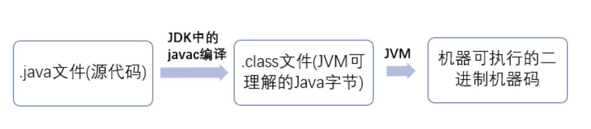
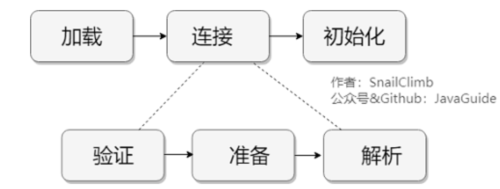
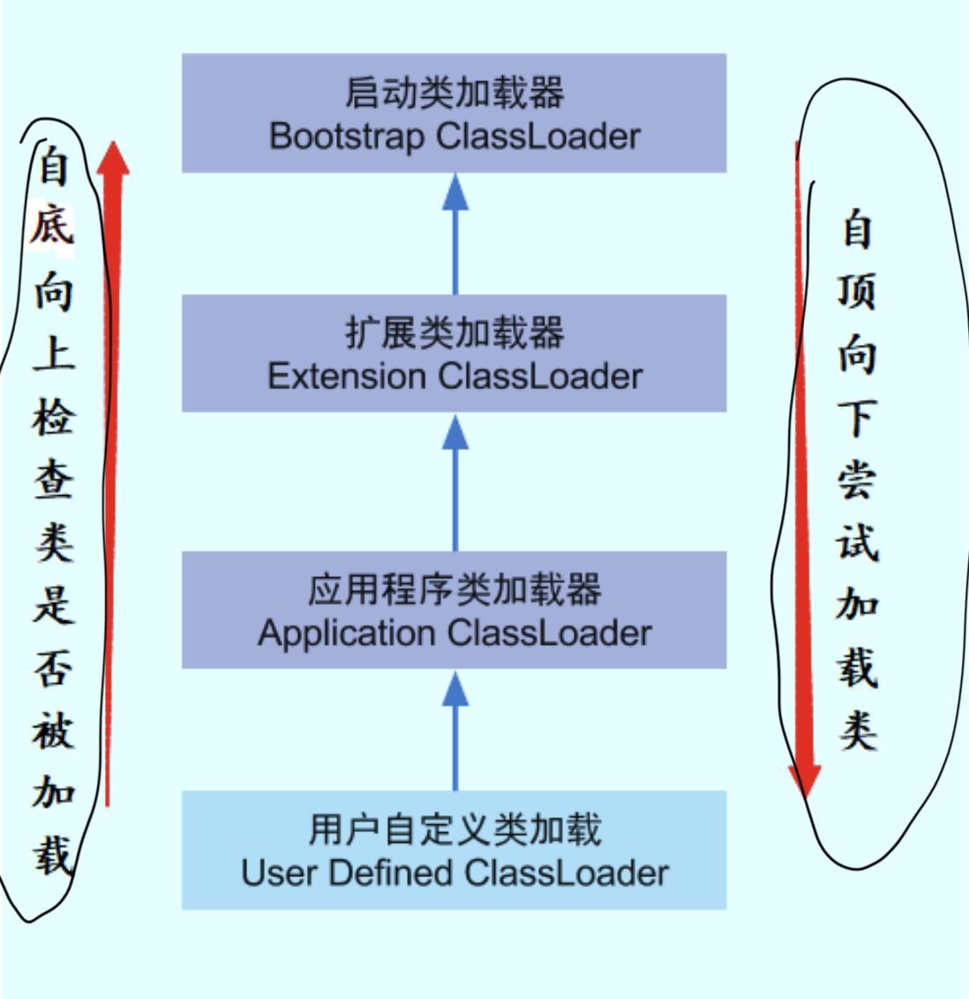
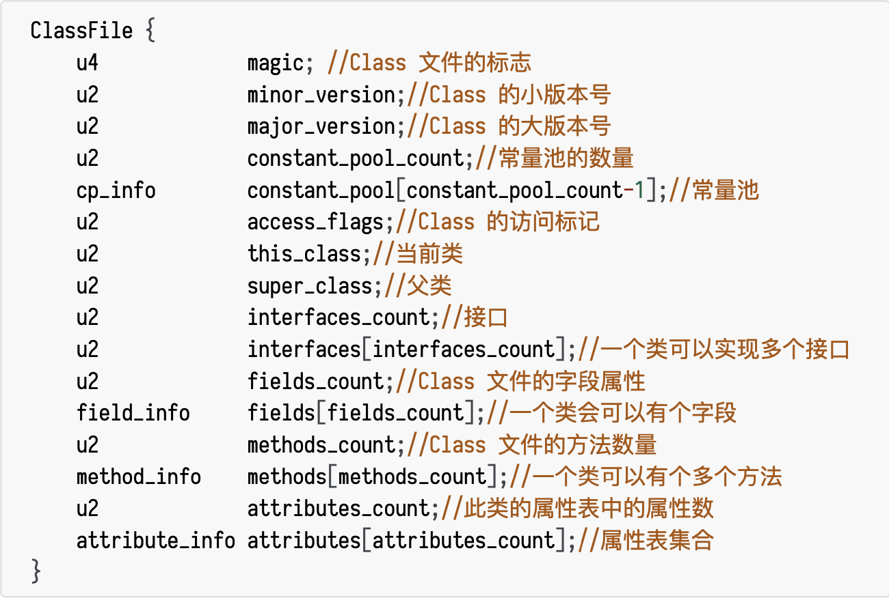
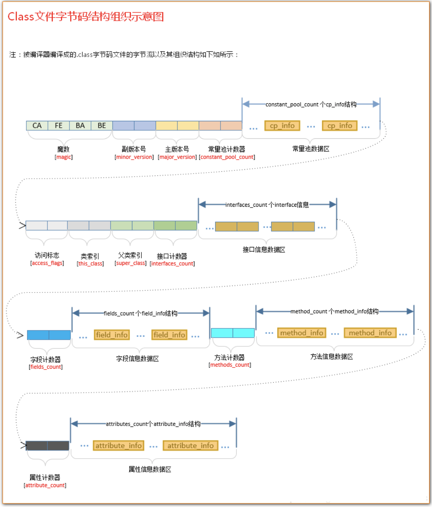
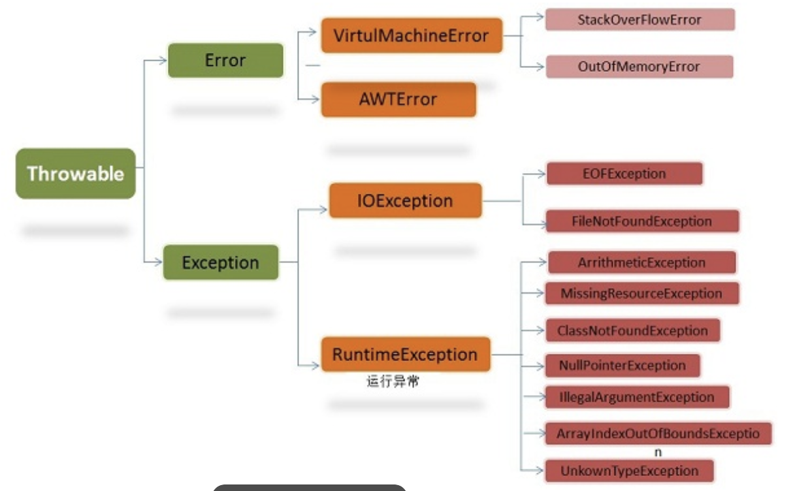

# Java面试知识整理

## 基础

###  Java 语言特点

1. 简单易学;
2. 面向对象(**封装，继承，多态**);
3. **平台无关性**( Java 虚拟机实现平台无关性);
4. 可靠性;
5. 安全性;
6. 支持多线程( C++ 语言没有内置的多线程机制，因此必须调用操作系统的多线程功能来进行多线程程序设计，而 Java 语言却提供了多线程支持);
7. 支持网络编程并且很方便( Java 语言诞生本身就是为简化网络编程设计的，因此 Java 语言不仅支持网络编程而且很方便);
8. 编译与解释并存

### JVM、 JDK 和 JRE

```
    
```


- JVM
  - Java 虚拟机(JVM)是运行 Java 字节码的虚拟机。JVM 有针对不同系统的特定实现(Windows， Linux，macOS)，目的是使用相同的字节码，它们都会给出相同的结果。

    - 在 Java 中，JVM 可以理解的代码就叫做 字节码 (即扩展名为 .class 的文件)，它不面向任 何特定的处理器，只面向虚拟机。Java 语言通过字节码的方式，在一定程度上解决了传统解释型语 言执行效率低的问题，同时又保留了解释型语言可移植的特点。所以 Java 程序运行时比􏰀高效， 而且，由于字节码并不针对一种特定的机器，因此，Java 程序无须重新编译便可在多种不同操作系 统的计算机上运行。
- JDK

  - JDK 是 Java Development Kit，它是功能⻬全的 Java SDK。它拥有 JRE 所拥有的一切，还有编译器 (javac)和工具(如 javadoc 和 jdb)。它能够创建和编译程序。
- JRE

  - JRE 是 Java 运行时环境。它是运行已编译 Java 程序所需的所有内容的集合，包括 Java 虚拟机 (JVM)，Java 类库，java 命令和其他的一些基础构件。但是，它不能用于创建新程序。

### 三大特性

- 继承、封装、多态

###  重载和重写

- 重载就是同样的一个方法能够根据输入数据的不同，做出不同的处理
  发生在同一个类中，方法名必须相同，参数类型不同、个数不同、顺序不同，方法返回值和访问修饰符 可以不同。
  - **注意**：返回类型不是方法的签名；也就是说不能有两个方法名相同，参数相同，返回类型不同的两个方法

- 重写就是当子类继承自父类的相同方法，输入数据一样，但要做出有别于父类的响应时，你就要覆 盖父类方法

  1. 返回值类型、方法名、参数列表必须相同，抛出的异常范围小于等于父类，访问修饰符范围大于 等于父类。
  2. 如果父类方法访问修饰符为 private/final/static 则子类就不能重写该方法，但是被 static 修饰的方法能够被再次声明。
  3. 构造方法无法被重写

### 接口和抽象类对比

1. 接口的方法默认是 public，所有方法在接口中不能有实现(Java 8 开始接口方法可以有默认实 现)，而抽象类可以有非抽象的方法。

2. 接口中除了 static、final 变量，不能有其他变量，而抽象类中则不一定。

3. 一个类可以实现多个接口，但只能实现一个抽象类。接口自己本身可以通过 extends 关键字扩
   展多个接口。

4. 接口方法默认修饰符是 public，抽象方法可以有 public、protected 和 default 这些修饰符
   (抽象方法就是为了被重写所以不能使用 private 关键字修饰!)。

5. 从设计层面来说，**抽象是对类的抽象，是一种模板设计，而接口是对行为的抽象，是一种行为的规范**。

   **注意：**

   1. 在 jdk 7 或更早版本中，接口里面只能有常量变量和抽象方法。这些接口方法必须由选择实现 接口的类实现。
   2. jdk8 的时候接口可以有默认方法和静态方法功能。
   3. Jdk 9 在接口中引入了私有方法和私有静态方法。

### 自动装箱与拆箱

- 装箱:将基本类型用它们对应的引用类型包装起来;Integer的valueOf(int)方法
- 拆箱:将包装类型转换为基本数据类型;Integer的intValue()方法
- 注意封装类使用“=”比较时的问题

  - 注意，Integer、Short、Byte、Character、Long这几个类的valueOf方法的实现都有缓存；Double、Float的valueOf方法的实现没有缓存。
  - 因此，在比较基本数据类型的封装类时使用equals更准确。

### 成员变量与局部变量

1. 从语法形式上看:成员变量是属于类的，而局部变量是在方法中定义的变量或是方法的参数;成员变量可以被 public,private,static 等修饰符所修饰，而局部变量不能被访问控制修饰符及 static 所修饰;但是，成员变量和局部变量都能被 final 所修饰。

2. 从变量在内存中的存储方式来看:如果成员变量是使用 static 修饰的，那么这个成员变量是属于类的，如果没有使用 static 修饰，这个成员变量是属于实例的。对象存于堆内存，如果局部变量类型为基本数据类型，那么存储在栈内存，如果为引用数据类型，那存放的是指向堆内存对象的引用或者是指向常量池中的地址。
3. 从变量在内存中的生存时间上看:成员变量是对象的一部分，它随着对象的创建而存在，而局部变量随着方法的调用而自动消失。
4. 成员变量如果没有被赋初值:则会自动以类型的默认值而赋值(一种情况例外:被 final 修饰的
   成员变量也必须显式地赋值)，而局部变量则不会自动赋值。

### 类加载

#### 流程



- **加载**

  - 1，通过全限定类名来获取定义此类的二进制字节流。
    2，将这个字节流所代表的静态存储结构转化为方法区的运行时数据结构。
    3，在内存中生成一个代表这个类的 java.lang.Class 对象，作为方法区这个类的各种数据的访问入口。

- **连接**

  - 验证

    - 验证是连接阶段的第一步，这一阶段的目的是为了确保 Class 文件的字节流中包含的信息符合当前虚拟机的要求，并且不会危害虚拟机自身的安全。

      - 1，文件格式验证：如是否以魔数 0xCAFEBABE 开头、主、次版本号是否在当前虚拟机处理范围之内、常量合理性验证等。
        此阶段保证输入的字节流能正确地解析并存储于方法区之内，格式上符合描述一个 Java类型信息的要求。
      - 2，元数据验证：是否存在父类，父类的继承链是否正确，抽象类是否实现了其父类或接口之中要求实现的所有方法，字段、方法是否与父类产生矛盾等。
        第二阶段，保证不存在不符合 Java 语言规范的元数据信息。
      - 3，字节码验证：通过数据流和控制流分析，确定程序语义是合法的、符合逻辑的。例如保证跳转指令不会跳转到方法体以外的字节码指令上。
      - 4，符号引用验证：在解析阶段中发生，保证可以将符号引用转化为直接引用。
      - 可以考虑使用 -Xverify:none 参数来关闭大部分的类验证措施，以缩短虚拟机类加载的时间。

  - 准备

    - 为类变量分配内存并设置类变量初始值，这些变量所使用的内存都将在方法区中进行分配。

  - 解析

    - 虚拟机将常量池内的符号引用替换为直接引用的过程。
      解析动作主要针对类或接口、字段、类方法、接口方法、方法类型、方法句柄和调用点限定符 7 类符号引用进行。

- **初始化**

  - 到初始化阶段，才真正开始执行类中定义的 Java 程序代码，此阶段是执行 <clinit>() 方法的过程。

  

- **类加载器**

  ​	概念：把实现类加载阶段中的“通过一个类的全限定名来获取描述此类的二进制字节流”这个动作的代码模块称为“类加载器”。

  **类的唯一性和类加载器**

  - 对于任意一个类，都需要由加载它的类加载器和这个类本身一同确立其在Java虚拟机中的唯一性。

    即使两个类来源于同一个 Class 文件，被同一个虚拟机加载，只要加载它们的类加载器不同，那这两个类也不相等。
    这里所指的“相等”，包括代表类的 Class 对象的 equals() 方法、 isAssignableFrom() 方法、isInstance() 方法的返回结果，也包括使用 instanceof 关键字做对象所属关系判定等情况。

    

  #### **双亲委派模型**

  ​		如果一个类加载器收到了类加载的请求，它首先不会自己去尝试加载这个类，而是把这个请求委派给父类加载器去完成，每一个层次的类加载器都是如此，因此所有的加载请求最终都应该传送到顶层的启动类加载器中，只有当父加载器反馈自己无法完成这个加载请求（它的搜索范围中没有找到所需的类）时，子加载器才会尝试自己去加载。

  

  

  #### 自定义类加载器

  - 步骤

    1，继承 java.lang.ClassLoader

    2，重写父类的 findClass() 方法


### 类文件结构



	上面的u2和u4分别代表两个字节和四个字节的无符号数，_info结尾表示是一个表结构，表结构可以理解为一个类，用于表示复合数据结构的数据。

#### **Class文件字节码结构组织示意图** 



1. **魔数****:** 确定这个文件是否为一个能被虚拟机接收的 Class 文件。

2. **Class 文件版本** :Class 文件的版本号，保证编译正常执行。

3. **常量池** :常量池主要存放两大常量:字面量和符号引用。

4. **访问标志** :标志用于识别一些类或者接口层次的访问信息，包括:这个 Class 是类还是接口，

   是否为 public 或者 abstract 类型，如果是类的话是否声明为 final 等等。

5. **当前类索引,父类索引** :类索引用于确定这个类的全限定名，父类索引用于确定这个类的父类的全限定名，由于 Java 语言的单继承，所以父类索引只有一个，除了 java.lang.Object 之 外，所有的 java 类都有父类，因此除了 java.lang.Object 外，所有 Java 类的父类索引 都不为 0。

6. **接口索引集合** :接口索引集合用来描述这个类实现了那些接口，这些被实现的接口将 按implents(如果这个类本身是接口的话则是extends) 后的接口顺序从左到右排列在接口索引集合中。

7. **字段表集合** :描述接口或类中声明的变量。字段包括类级变量以及实例变量，但不包括在方法内部声明的局部变量。

8. **方法表集合** :类中的方法。

9. **属性表集合** : 在 Class 文件，字段表，方法表中都可以携带自己的属性表集合。

   

### String、StringBuffer、StringBuilder

- **String**
  - 1，使用 final 关键字修饰字符数组来保存字符串，private final char value[]，所以 String 对象是不可变的。
    2，线程安全

- **StringBuffer**
  - 1，可变
    2，实现同步锁，线程安全
    3，性能相对比于**StringBuilder**低

- **StringBuilder**
  - 1，可变
    2，线程不安全
    3，性能相对比于**StringBuffer**高

**三者使用的总结**

- 操作少量的数据: 适用 **String**
- 单线程操作字符串缓冲区下操作大量数据: 适用 **StringBuilder** 
- 多线程操作字符串缓冲区下操作大量数据: 适用 **StringBuffer**

### hashCode 与 equals

- hashCode()介绍

  - hashCode() 的作用是获取哈希码，也称为散列码;它实际上是返回一个 int 整数。这个哈希码的作用 是确定该对象在哈希表中的索引位置。hashCode() 定义在 JDK 的 Object.java 中，这就意味着 Java 中的任何类都包含有 hashCode() 函数。
    散列表存储的是键值对(key-value)，它的特点是:能根据“键”快速的检索出对应的“值”。这其中就利 用到了散列码!(可以快速找到所需要的对象)

- 为什么要有 hashCode

  - 以“HashSet 如何检查重复”为例子来说明为什么要有 hashCode: 当你把对象加入 HashSet 时，HashSet 会先计算对象的 hashcode 值来判断对象加入的位置，同时也会与该位置其他已经加入的 对象的 hashcode 值作比，如果没有相符的 hashcode，HashSet 会假设对象没有重复出现。但是如果发现有相同 hashcode 值的对象，这时会调用 equals() 方法来检查 hashcode 相等的对象是否真的相同。如果两者相同，HashSet 就不会让其加入操作成功。如果不同的话，就会重新散列到其他位 置。(摘自我的 Java 启蒙书《Head first java》第二版)。这样我们就大大减少了 equals 的次 数，相应就大大提高了执行速度。
    因此看出:hashCode() 的作用就是获取哈希码，也称为散列码;它实际上是返回一个 int 整数。这个哈希码的作用是确定该对象在哈希表中的索引位置。 hashCode() 在散列表中才有用，在
    其它情况下没用。在散列表中 hashCode() 的作用是获取对象的散列码，进而确定该对象在散列表中的位置。

- 简单通用的**hashCode**算法

  - 初始化一个整形变量，为此变量赋予一个非零的常数值，比如int result = 17;

  - 选取equals方法中用于比较的所有域，然后针对每个域的属性进行计算：

      (1) 如果是boolean值，则计算f ? 1:0

      (2) 如果是byte\char\short\int,则计算(int)f

      (3) 如果是long值，则计算(int)(f ^ (f >>> 32))

      (4) 如果是float值，则计算Float.floatToIntBits(f)

      (5) 如果是double值，则计算Double.doubleToLongBits(f)，然后返回的结果是long,再用规则(3)去处理long,得到int

      (6)如果是对象应用，如果equals方法中采取递归调用的比较方式，那么hashCode中同样采取递归调用hashCode的方式。否则需要为这个域计算一个范式，比如当这个域的值为null的时候，那么hashCode值为0

      (7)如果是数组，那么需要为每个元素当做单独的域来处理。如果你使用的是1.5及以上版本的JDK，那么没必要自己去重新遍历一遍数组，java.util.Arrays.hashCode方法包含了8种基本类型数组和引用数组的hashCode计算，算法同上

### 泛型

​		泛型是在JDK1.5之后出现的。

​		泛型的本质是参数化类型，也就是说所操作的数据类型被指定为一个参数。

- 主要目标有以下几点：

  - **类型安全** 
    - 泛型的主要目标是提高 Java 程序的类型安全
    - 编译时期就可以检查出因 Java 类型不正确导致的 ClassCastException 异常
    - 符合越早出错代价越小原则

  - **消除强制类型转换**
    - 泛型的一个附带好处是，使用时直接得到目标类型，消除许多强制类型转换
    - 所得即所需，这使得代码更加可读，并且减少了出错机会

  - **潜在的性能收益** 
    - 由于泛型的实现方式，支持泛型（几乎）不需要 JVM 或类文件更改
    - 所有工作都在编译器中完成
    - 编译器生成的代码跟不使用泛型（和强制类型转换）时所写的代码几乎一致，只是更能确保类型安全而已

### 对象的序列化

- 概念：Java中对象的序列化指的是将对象转换成以字节序列的形式来表示，这些字节序列包含了对象的数据和信息，一个序列化后的对象可以被写到数据库或文件中，也可用于网络传输，一般当我们使用缓存cache（内存空间不够有可能会本地存储到硬盘）或远程调用rpc（网络传输）的时候，经常需要让我们的实体类实现Serializable接口，目的就是为了让其可序列化。
- 序列化的接口：Serializable
- 关键字transient

  - 让某些被修饰的成员属性变量不被序列化
  - 如下情况可考虑：

    - 1、类中的字段值可以根据其它字段推导出来，如一个长方形类有三个属性：长度、宽度、面积（示例而已，一般不会这样设计），那么在序列化的时候，面积这个属性就没必要被序列化了；
    - 2、其它，看具体业务需求吧，哪些字段不想被序列化；
    - PS:HashMap源码中，有个字段是用transient修饰的-modCount，modCount主要用于判断HashMap是否被修改（像put、remove操作的时候，modCount都会自增），对于这种变量，一开始可以为任何值，0当然也是可以（new出来、反序列化出来、或者克隆clone出来的时候都是为0的），没必要持久化其值。

  - 为什么要不被序列化呢，主要是为了节省存储空间，其它的感觉没啥好处，可能还有坏处（有些字段可能需要重新计算，初始化什么的），总的来说，利大于弊。

### Java 中的异常处理



- **Error**(错误):是程序无法处理的错误，表示运行应用程序中严重问题。大多数错误与代码编写者执 行的操作无关，而表示代码运行时 JVM(Java 虚拟机)出现的问题。例如，Java 虚拟机运行错误 (Virtual MachineError)，当 JVM 不再有继续执行操作所需的内存资源时，将出现 OutOfMemoryError。这些异常发生时，Java 虚拟机(JVM)一般会选择线程终止。
- **Exception**(异常):是程序本身可以处理的异常；Exception 类有一个重要的子类RuntimeException。RuntimeException 异常由 Java 虚拟机抛出。
- 异常和错误的区别:异常能被程序本身处理，错误是无法处理。
- 在以下 4 种特殊情况下，finally 块不会被执行:
  1. 在 finally 语句块第一行发生了异常。 因为在其他行，finally 块还是会得到执行
  2. 在前面的代码中用了 System.exit(int)已退出程序。 exit 是带参函数 ;若该语句在异常语句
     之后，finally 会执行
  3. 程序所在的线程死亡。
  4. 关闭 CPU。