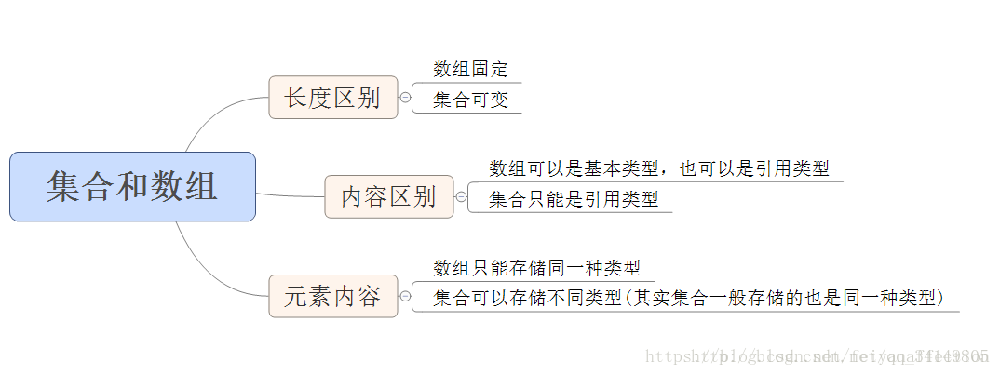
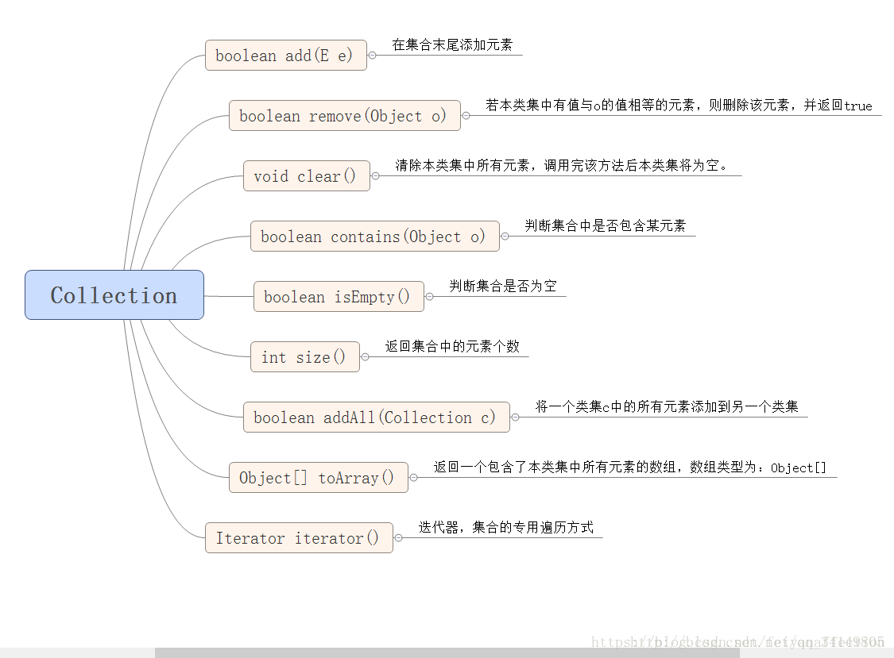
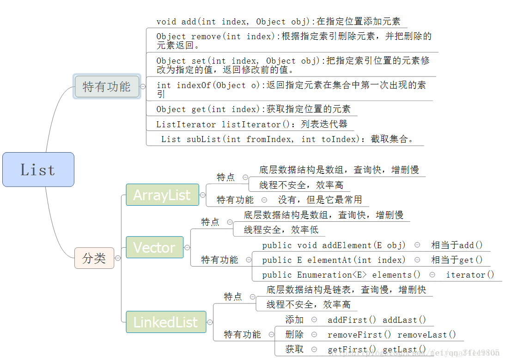
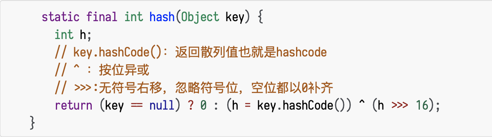
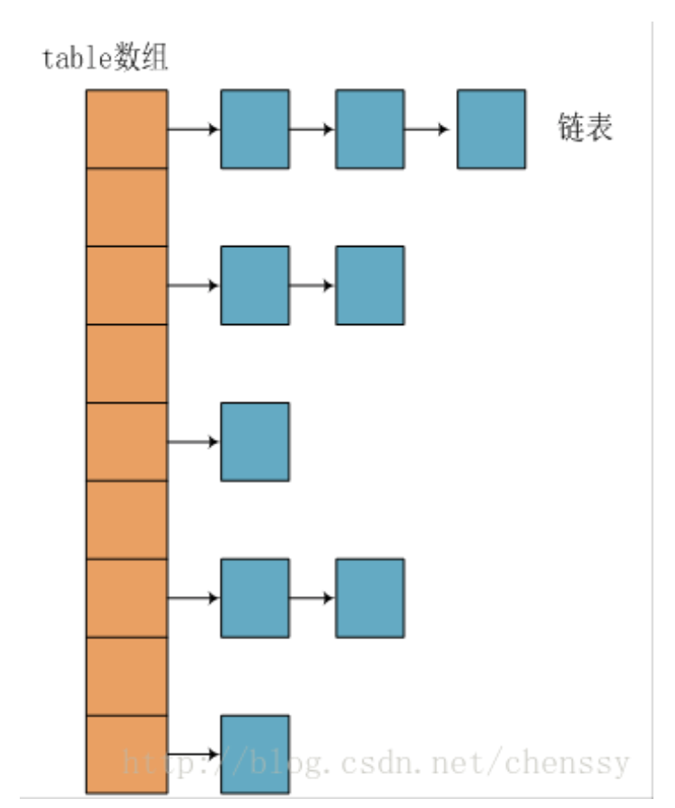
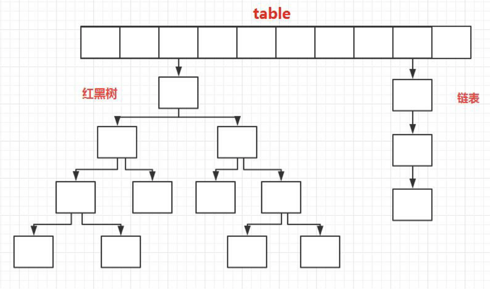
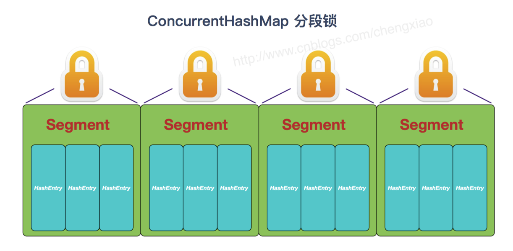
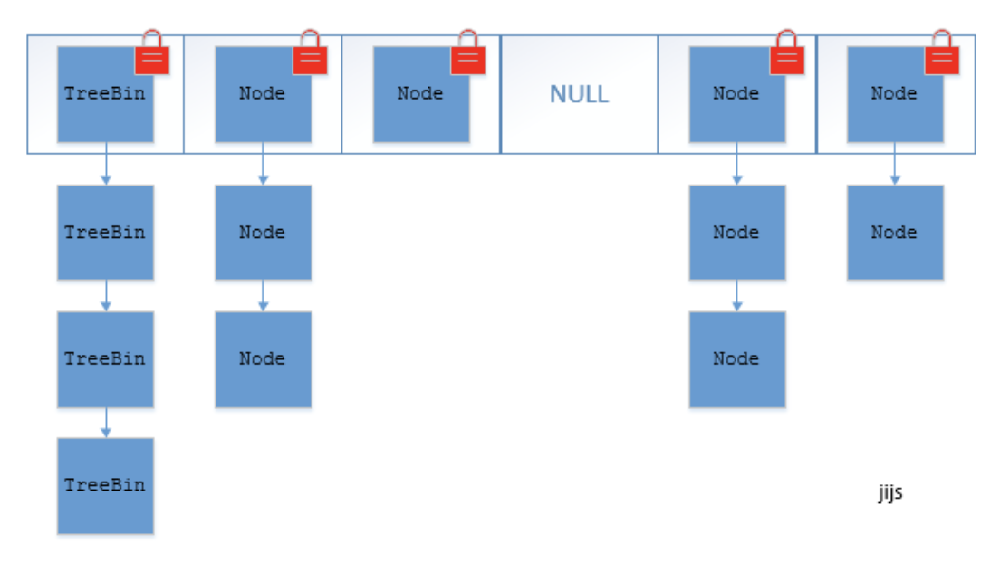
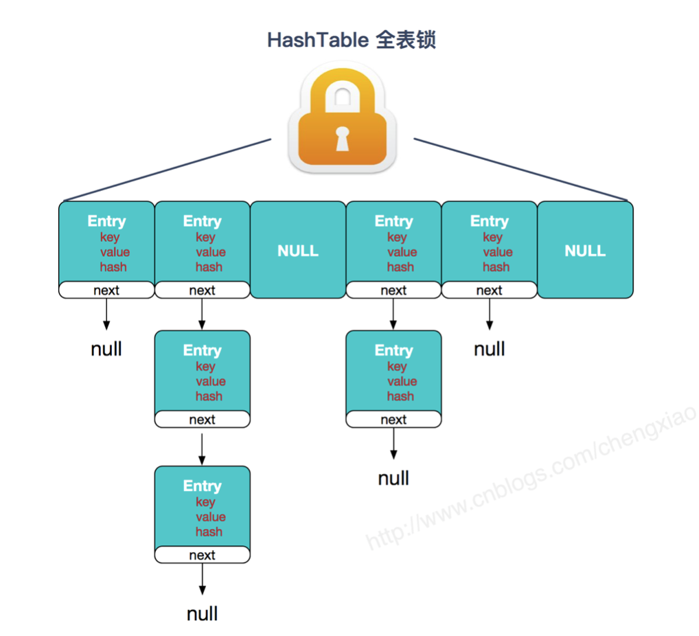

# Java面试知识整理

## 容器

###  Java集合

**集合与数组的区别：**

#### Collection集合的方法

#### List

​	元素按进入先后有序保存，可重复

- **ArrayList**

  **ArrayList 的扩容机制**

  在JDK1.8中，如果通过无参构造的话，初始数组容量为0，当真正对数组进行添加时（即添加第一个元素时），才真正分配容量，**默认分配容量为10**；当容量不足时（容量为size，添加第size+1个元素时），**先判断按照1.5倍（位运算）的比例扩容能否满足最低容量要求，若能，则以1.5倍扩容，否则以最低容量要求进行扩容。**

  执行add(E e)方法时，先判断ArrayList当前容量是否满足size+1的容量；
  在判断是否满足size+1的容量时，先判断ArrayList是否为空，若为空，则先初始化ArrayList初始容量为10，再判断初始容量是否满足最低容量要求；若不为空，则直接判断当前容量是否满足最低容量要求；
  若满足最低容量要求，则直接添加；若不满足，则先扩容，再添加。

  ArrayList的最大容量为Integer.MAX_VALUE

  

  **ArrayList特点：**

  - 线程不安全
  - Arraylist 底层使用的是 Object 数组
  - ArrayList 采用数组存储，所以插入和删除元素的时间复杂度受元素位置的影响。比如:执行add(E e)方法的时候，ArrayList 会默认 在将指定的元素追加到此列表的末尾，这种情况时间复杂度就是O(1)。但是如果要在指定位置 i 插入和删除元素的话(add(int index, E element))时间复杂度就为 O(n-i)。因为在进 行上述操作的时候集合中第 i 和第 i 个元素之后的(n-i)个元素都要执行向后位/向前移一位的操作。
  - 快速随机访问
  - 内存占用少

- **LinkedList**

  **特点**

  - 线程不安全
  - LinkedList 底层使用的是**双向链表**数据结构(**注意**：不是循环链表)
  - LinkedList 采用**链表存储**，所以对于add(​E e)方法的插入，删除元素时间复杂度不受元素位置的影响，近似 O(1)，如果是要在指定位置i插入和删除元素的话 ((add(int index, E element)) 时间复杂度近似为o(n))因为需要先移动到指定位置 再插入。
  - 内存占用多

- **Vector**

  - 线程同步的，保证线程的安全的同时牺牲了效率。

#### set

​	仅接收一次，不可重复，并做内部排序

- **HashSet**(无序，唯一)

  - HashSet如何检查重复

    - 当你把对象加入 HashSet 时，HashSet会先计算对象的 hashcode 值来判断对象加入的位置，同时也会 与其他加入的对象的hashcode值作比较，如果没有相符的hashcode，HashSet会假设对象没有重复出 现。但是如果发现有相同hashcode值的对象，这时会调用 equals() 方法来检查hashcode相等的对 象是否真的相同。如果两者相同，HashSet就不会让加入操作成功。

- **LinkedHashSet**

  -  LinkedHashSet 继承于 HashSet，并且其内部是通过 LinkedHashMap 来实现 的。有点类似于我们之前说的LinkedHashMap 其内部是基于 HashMap 实现一样，不过还是有一点点区别的

- **TreeSet**((有序，唯一))

  - 红黑树(自平衡的排序二叉树)

  - 排序通过构造器传入自定义**Comparator**类进行排序

    

  **HashSet与TreeSet区别使用指南**：

  HashSet是基于Hash算法实现的,其性能通常优于TreeSet,我们通常都应该使用HashSet,在我们需要排序的功能时,我们才使用TreeSet;

#### map

​	 键值对的集合

##### **HashMap**

https://zhuanlan.zhihu.com/p/21673805

- 底层原理

  - **JDK1.8之前**
    - JDK1.8 之前 HashMap 底层是 数组和链表 结合在一起使用也就是 链表散列。HashMap 通过 key 的 hashCode 经过扰动函数处理过后得到 hash 值，然后通过 (n - 1) & hash 判断当前元素存放的位置 (这里的 n 指的是数组的⻓度)，如果当前位置存在元素的话，就判断该元素与要存入的元素的 hash 值以及 key 是否相同，如果相同的话，直接覆盖，不相同就通过拉链法解决冲突。

  **所谓扰动函数指的就是 HashMap 的 hash 方法。使用 hash 方法也就是扰动函数是为了减少碰撞。**

​	JDK 1.8 HashMap 的 hash 方法源码

在JDK1.8的实现中，优化了高位运算的算法，通过hashCode()的高16位**异或**低16位实现的：(h = k.hashCode()) ^ (h >>> 16)，主要是从速度、功效、质量来考虑的，这么做**可以在数组table的length比较小的时候，也能保证考虑到高低Bit都参与到Hash的计算中**，同时不会有太大的开销。

​	

**JDK1.8之后**

  相比于之前的版本， JDK1.8之后在解决哈希冲突时有了􏰀大的变化，当**链表⻓度大于阈值(默认为8)**
  时，将链表转化为**红黑树**，以**减少搜索时间**。

**总结：**

- HashMap 是非线程安全的（如果想要确保线程安全使用ConcurrentHashMap）

- 效率，相对于HashTable高

- HashMap 中，null 可以作为键，这样的键只有一个，可以 有一个或多个键所对应的值为 null。

- 初始容量大小和每次扩充容量大小：

  - 1，创建时如果不指定容量初始值，HashMap 默认的初始化大小为16。之后每次扩充，容量变为原来的2倍。

  -  创建时如果给定了容量初始值HashMap 会将其扩充为2的幂次方大小。也就是说 HashMap 总是使用2的幂作为哈希表的大小。

    

  **问题：HashMap 的⻓度为什么是2的幂次方**

  > 为了能让 HashMap 存取高效，尽量较少碰撞，也就是要尽量把数据分配均匀。Hash 值的范围值-2147483648到2147483647，前后加起来大概40亿的映射空间，只要哈希函数映射 得比较均匀松散，一般应用是很难出现碰撞的。但问题是一个40亿⻓度的数组，内存是放不下的。所以 这个散列值是不能直接拿来用的。用之前还要先对**数组的⻓度取模运算**，得到的余数用来要存放的位置也就是对应的数组下标。数学中，当取模运算如果除数是2的幂次则等价于与其除数减一的与（&）运算。而且求与（&）比取模运算效率高。

  **这个算法应该如何设计呢?**

  >  我们首先可能会想到采用%取余的操作来实现。但是，“取余(%)操作中如果除数是2的幂次则 等价于与其除数减一的与(&)操作(也就是说 hash%length==hash&(length-1)的前提是 length 是2的 n 次方;)。” 并且采用二进制位操作 &，相对于%能够提高运算效率，这就解释了 HashMap 的⻓度为什么是2的幂次方。

##### Hashtable（基本被淘汰）

- ​	线程安全

- ​	HashTable 中 put 进的键值只要有一个 null， 直接抛出 NullPointerException。

- ​	初始容量大小和每次扩充容量大小：

  ​	1，Hashtable 默认 的初始大小为11，之后每次扩充，容量变为原来的2n+1。

  ​	2，创建时如果给定了容量初始值，那么 Hashtable 会直接使用你给定的大小。

  ##### ConcurrentHashMap

  - ​	**与HashTable实现线程安全的方式对比：**

    - **ConcurrentHashMap**(分段锁)

      在JDK1.7的时候，ConcurrentHashMap(分段锁) 对整个桶数组进行了分割分段(Segment)，每一把锁只锁容器其中一部分数据，多线程访问容器里不同数据段的数据，就不会存在锁竞争，提高并发访问率。 到了JDK1.8 的时候已经摒弃了Segment的 概念，而是直接用 Node 数组+链表+红黑树的数据结构来实现，并发控制使用 synchronized 和 CAS 来操作。(JDK1.6以后 对 synchronized锁做了很多优化) 整个看起来就像是优化过且线 程安全的 HashMap，虽然在JDK1.8中还能看到 Segment 的数据结构，但是已经简化了属性，只是为了兼容旧版本;

      **JDK1.7之前：**

      ​	

    **JDK1.8的ConcurrentHashMap(TreeBin: 红黑二叉树节点 Node:链表节点)** ：

    

    - **HashTable**

       Hashtable(同一把锁) :使用 synchronized 来保证线程安全，效率非常 低下。当一个线程访问同步方法时，其他线程也访问同步方法，可能会进入阻塞或轮询状态，如 使用 put 添加元素，另一个线程不能使用 put 添加元素，也不能使用 get，竞争会越来越激烈 效率越低。

      

- ##### TreeMap

	- 有序，唯一
	
	- 红黑树(自平衡的排序二叉树)
	
	  

**集合重要方法comparable 和 Comparator**：

- comparable接口实际上是出自java.lang包 它有一个 compareTo(Object obj)方法用来排序
- comparator接口实际上是出自 java.util 包它有一个compare(Object obj1, Object obj2) 方法用来排序
- 一般我们需要对一个集合使用自定义排序时，我们就要重写 compareTo() 方法或 compare() 方法， 当我们需要对某一个集合实现两种排序方式，比如一个song对象中的歌名和歌手名分别采用一种排序方 法的话，我们可以重写 compareTo() 方法和使用自制的Comparator方法或者以两个Comparator来实现 歌名排序和歌星名排序，第二种代表我们只能使用两个参数版的 Collections.sort() .