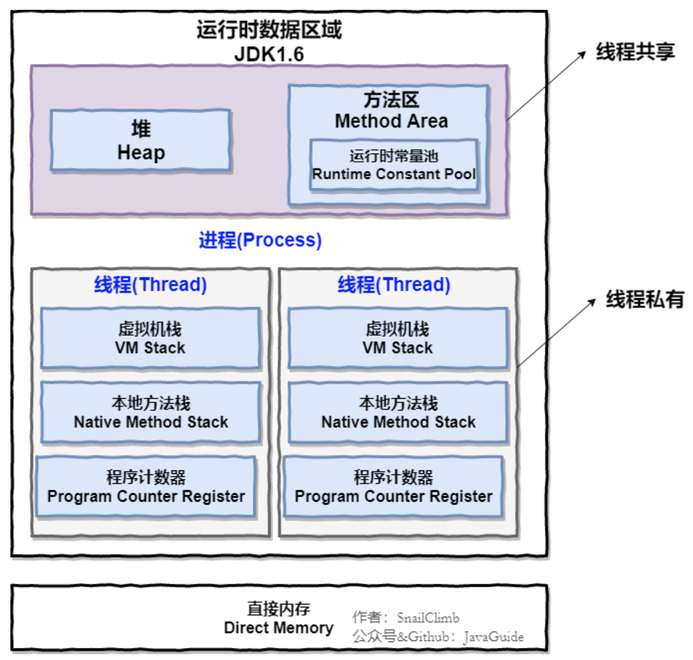
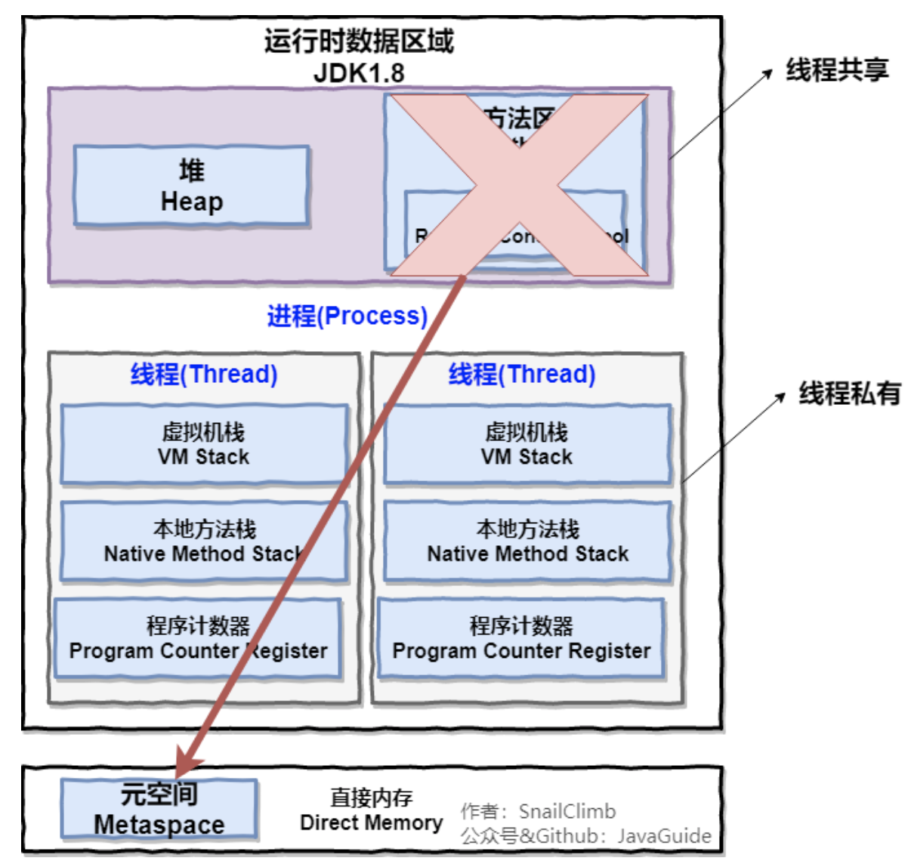

```
---
layout:     post
title:      Java面试知识整理-虚拟机
subtitle:   面试专题，虚拟机
date:       2020-01-11
author:     Lij
header-img: img/post-bg-coffee.jpeg
catalog: true
tags:
    - 面试
    - Java
    - 虚拟机

---
```

# Java面试知识整理

## 虚拟机

###  Java 内存区域

Java 虚拟机在执行 Java 程序的过程中会把它管理的内存划分成若干个不同的数据区域。JDK. 1.8 和 之前的版本略有不同，下面会介绍到。

- 1.8之前

  

- 1.8之后

  

  > 直接内存并不是虚拟机运行时数据区的一部分，也不是虚拟机规范中定义的内存区域，但是这部分内存 也被频繁地使用。而且也可能导致 OutOfMemoryError 异常出现。
  >
  > JDK1.4 中新加入的 NIO(New Input/Output) 类，引入了一种基于通道(Channel) 与缓存区 (Buffer) 的 I/O 方式，它可以直接使用 Native 函数库直接分配堆外内存，然后通过一个存储在 Java 堆中的 DirectByteBuffer 对象作为这块内存的引用进行操作。这样就能在一些场景中显著提高性能，因为避免了在 Java 堆和 Native 堆之间来回复制数据。
  >
  > 本机直接内存的分配不会收到 Java 堆的限制，但是，既然是内存就会受到本机总内存大小以及处理器 寻址空间的限制。

- 程序计数器的作用：

  程序计数器是一块较小的内存空间，可以看作是当前线程所执行的字节码的行号指示器。字节码解释器 工作时通过改变这个计数器的值来选取下一条需要执行的字节码指令，分支、循环、跳转、异常处理、 线程恢复等功能都需要依赖这个计数器来完。

  另外，为了线程切换后能恢复到正确的执行位置，每条线程都需要有一个独立的程序计数器，各线程之 间计数器互不影响，独立存储，我们称这类内存区域为“线程私有”的内存。

  - 1. 字节码解释器通过改变程序计数器来依次读取指令，从而实现代码的流程控制，如:顺序执行、 选择、循环、异常处理。

  - 2. 在多线程的情况下，程序计数器用于记录当前线程执行的位置，从而当线程被切换回来的时候能 够知道该线程上次运行到哪儿了。

    **注意**:程序计数器是唯一一个不会出现 OutOfMemoryError 的内存区域，它的生命周期随着线程的创建 而创建，随着线程的结束而死亡。

- Java 虚拟机栈

  与程序计数器一样，Java虚拟机栈也是线程私有的，它的生命周期和线程相同，描述的是 Java 方法执行的内存模型，每次方法调用的数据都是通过栈传递的。

  Java 内存可以粗糙的区分为堆内存(Heap)和栈内存(Stack),其中栈就是现在说的虚拟机栈，或者说 是虚拟机栈中局部变量表部分。 (实际上，Java虚拟机栈是由一个个栈帧组成，而每个栈帧中都拥 有:局部变量表、操作数栈、动态链接、方法出口信息。)

  局部变量表主要存放了编译器可知的各种数据类型(boolean、byte、char、short、int、float、 long、double)、对象引用(reference类型，它不同于对象本身，可能是一个指向对象起始地址的引 用指针，也可能是指向一个代表对象的句柄或其他与此对象相关的位置)。

  Java 虚拟机栈会出现两种异常:StackOverFlowError 和 OutOfMemoryError。
  StackOverFlowError: 若Java虚拟机栈的内存大小不允许动态扩展，那么当线程请求栈的深度 超过当前Java虚拟机栈的最大深度的时候，就抛出StackOverFlowError异常。
  OutOfMemoryError: 若 Java 虚拟机栈的内存大小允许动态扩展，且当线程请求栈时内存用完 了，无法再动态扩展了，此时抛出OutOfMemoryError异常。

- 本地方法栈

  和虚拟机栈所发挥的作用非常相似，区别是: 虚拟机栈为虚拟机执行 Java 方法 (也就是字节码)服 务，而本地方法栈则为虚拟机使用到的 Native 方法服务。 在 HotSpot 虚拟机中和 Java 虚拟机栈合 二为一。

- 堆

  Java 虚拟机所管理的内存中最大的一块，Java 堆是所有线程共享的一块内存区域，在虚拟机启动时创建。此内存区域的唯一目的就是存放对象实例，几乎所有的对象实例以及数组都在这里分配内存。

  Java 堆是垃圾收集器管理的主要区域，因此也被称作GC堆(Garbage Collected Heap).从垃圾回收的⻆度，由于现在收集器基本都采用分代垃圾收集算法，所以Java堆还可以细分为:新生代和老年代:再 细致一点有:Eden空间、From Survivor、To Survivor空间等。进一步划分的目的是更好地回收内存， 或者更快地分配内存。

  

  - 上图所示的 eden区、s0区、s1区都属于新生代，tentired 区属于老年代。大部分情况，对象都会首先 在 Eden 区域分配，在一次新生代垃圾回收后，如果对象还存活，则会进入 s0 或者 s1，并且对象的 年龄还会加 1(Eden区i>Survivor 区后对象的初始年龄变为1)，当它的年龄增加到一定程度(默认为15 岁)，就会被晋升到老年代中。对象晋升到老年代的年龄阈值，可以通过参数 -
    XX:MaxTenuringThreshold 来设置

- 方法区

  方法区与 Java 堆一样，是各个线程共享的内存区域，它用于存储已被虚拟机加载的类信息、常量、静态变量、即时编译器编译后的代码等数据。虽然Java虚拟机规范把方法区描述为堆的一个逻辑部分，但 是它却有一个别名叫做 Non-Heap(非堆)，目的应该是与 Java 堆区分开来。

  - JDK1.8以前

    ```
    -  -XX:PermSize=N //方法区(永久代)初始大小
       -XX:MaxPermSize=N //方法区(永久代)最大大小,超过这个值将会抛出 OutOfMemoryError异常:java.lang.OutOfMemoryError: PermGen
    
    ```

    JDK1.8之后

    ```
    -XX:MetaspaceSize=N //设置Metaspace的初始(和最小大小) 
     -XX:MaxMetaspaceSize=N //设置Metaspace的最大大小
    ```

  - JDK1.8之后将永久代（PermGen）代替为元空间（MetaSpace）

    - 其中一部分**原因**：
      整个永久代有一个 JVM 本身设置固定大小上线，无法进行调整，而元空间使用的是直接内存，受本机可用内存的限制，并且永远不会得到java.lang.OutOfMemoryError。你可以使用 -XX: MaxMetaspaceSize 标志设置最大元空间大小，默认值为 unlimited，这意味着它只受系统内存的限制。-XX:MetaspaceSize 调整标志定义元空间的初始大小如果未指定此标志，则 Metaspace 将根 据运行时的应用程序需求动态地重新调整大小。

  - 运行时常量池

    

    运行时常量池是方法区的一部分。Class 文件中除了有类的版本、字段、方法、接口等描述信息外，还有常量池信息(用于存放编译期生成的各种字面量和符号引用)

    既然运行时常量池是方法区的一部分，自然受到方法区内存的限制，当常量池无法再申请到内存时会抛 出 OutOfMemoryError 异常。

    JDK1.7及之后版本的 JVM 已经将运行时常量池从方法区中移了出来，在 Java 堆(Heap)中开辟了一 块区域存放运行时常量池。

### Java对象的创建过程


#### 	类加载检查: 

​		虚拟机遇到一条 new 指令时，首先将去检查这个指令的参数是否能在常量池中定位到 这个类的符号引用，并且检查这个符号引用代表的类是否已被加载过、解析和初始化过。如果没有，那必须先执行相应的类加载过程。

#### 	分配内存: 

​		在类加载检查通过后，接下来虚拟机将为新生对象分配内存。对象所需的内存大小在类 加载完成后便可确定，为对象分配空间的任务等同于把一块确定大小的内存从 Java 堆中划分出来。分 配方式有 “指针碰撞” 和 “空闲列表” 两种，选择那种分配方式由 Java 堆是否规整决定，而Java堆是 否规整又由所采用的垃圾收集器是否带有压缩整理功能决定。

- 分配内存的方式

  选择以下两种方式中的哪一种，取决于 Java 堆内存是否规整。而 Java 堆内存是否规整，取决于 GC 收集器的算法是"标记-清除"，还是"标记-整理"(也称作"标记-压缩")，值得注意的是，复制算法内存也是规整的。

  - 指针碰撞

    - 使用场景：堆内存规整（即没有内存碎片）的情况下
    - 原理：用过的内存全部整合到一边，没有用过的内存放在另一边，中间有个分界值指针，只需要向着没用过的内存方向将该指针移动对象内存大小位置即可
    - GC收集器：Serial、ParNew

  - 空闲列表

    - 适用场景：堆内存不规整的情况下
    - 原理：虚拟机会维护一个列表，该表中会记录哪些内存可用，哪些不可用。在分配的时候，找一块足够大的内存块来划分对象实例，最后更新列表记录。
    - GC收集器：CMS

- 内存分配并发问题

  ​	在创建对象的时候有一个很重要的问题，就是线程安全，因为在实际开发过程中，创建对象是很频繁的事情，作为虚拟机来说，必须要保证线程是安全的，通常来讲，虚拟机采用两种方式来保证线程安全:

  - CAS+失败重试: CAS 是乐观锁的一种实现方式。所谓乐观锁就是，每次不加锁而是假设没有冲 突而去完成某项操作，如果因为冲突失败就重试，直到成功为止。虚拟机采用 CAS 配上失败重 试的方式保证更新操作的原子性。
  - TLAB: 为每一个线程预先在Eden区分配一块儿内存，JVM在给线程中的对象分配内存时，首先在 TLAB分配，当对象大于TLAB中的剩余内存或TLAB的内存已用尽时，再采用上述的CAS进行内存分配

  #### 初始化零值: 

  ​	内存分配完成后，虚拟机需要将分配到的内存空间都初始化为零值(不包括对象 头)，这一步操作保证了对象的实例字段在 Java 代码中可以不赋初始值就直接使用，程序能访问到这 些字段的数据类型所对应的零值。

  #### 设置对象头:

  ​	 初始化零值完成之后，虚拟机要对对象进行必要的设置，例如这个对象是那个类的实 例、如何才能找到类的元数据信息、对象的哈希吗、对象的 GC 分代年龄等信息。 这些信息存放在对 象头中。 另外，根据虚拟机当前运行状态的不同，如是否启用偏向锁等，对象头会有不同的设置方 式。

  #### 执行 init 方法: 

  ​	在上面工作都完成之后，从虚拟机的视⻆来看，一个新的对象已经产生了，但从 Java 程序的视⻆来看，对象创建才刚开始，<init> 方法还没有执行，所有的字段都还为零。所以一 般来说，执行 new 指令之后会接着执行 <init> 方法，把对象按照程序员的意愿进行初始化，这样 一个真正可用的对象才算完全产生出来。

### 对象的访问定位

- **句柄:** 如果使用句柄的话，那么Java堆中将会划分出一块内存来作为句柄池，reference 中存
  储的就是对象的句柄地址，而句柄中包含了对象实例数据与类型数据各自的具体地址信息;

- **直接指针:** 如果使用直接指针访问，那么 Java 堆对象的布局中就必须考虑如何放置访问类型 数据的相关信息，而reference 中存储的直接就是对象的地址。

  > 这两种对象访问方式各有优势。使用句柄来访问的最大好处是 reference 中存储的是稳定的句柄地 址，在对象被移动时只会改变句柄中的实例数据指针，而 reference 本身不需要修改。使用直接指针 访问方式最大的好处就是速度快，它节省了一次指针定位的时间开销。

### 堆内存中对象的分配的基本策略

- 堆空间的基本结构

  

  - 上图所示的 eden区、s0区、s1区都属于新生代，tentired 区属于老年代。大部分情况，对象都会首先 在 Eden 区域分配，在一次新生代垃圾回收后，如果对象还存活，则会进入 s0 或者 s1，并且对象的 年龄还会加 1(Eden区i>Survivor 区后对象的初始年龄变为1)，当它的年龄增加到一定程度(默认为15 岁)，就会被晋升到老年代中。对象晋升到老年代的年龄阈值，可以通过参数 -
    XX:MaxTenuringThreshold 来设置。
  - 堆内存常见分配策略

    - 对象优先在eden区分配
    - 大对象直接进入老年代
    - 长期存活的对象将进入老年代

### Minor Gc和Full GC 有什么不同呢

​	大多数情况下，对象在新生代中 eden 区分配。当 eden 区没有足够空间进行分配时，虚拟机将发起一
次Minor GC。

​	新生代GC(Minor GC):指发生新生代的的垃圾收集动作，Minor GC非常频繁，回收速度一般也比较快。
老年代GC(Major GC/Full GC):指发生在老年代的GC，出现了Major GC经常会伴随至少一次的 Minor GC(并非绝对)，Major GC的速度一般会比Minor GC的慢10倍以上。

### 垃圾回收算法

> 内存回收的方法论

#### 标记-清除算法

​	它是最基础的收集算法。算法分为“标记”和“清除”阶段:首先标记出所有需要回收的对象，在标记完成后统一回收所有被标记的 对象。


**问题：**

- ​	效率问题
- ​	空间问题(标记清除后会产生大量不连续的碎片)

#### 复制算法

​	为了解决效率问题，“复制”收集算法出现了。它可以将内存分为大小相同的两块，每次使用其中的一 块。当这一块的内存使用完后，就将还存活的对象复制到另一块去，然后再把使用的空间一次清理掉。 这样就使每次的内存回收都是对内存区间的一半进行回收。


#### 标记-整理算法

根据老年代的特点推出的一种标记算法，标记过程仍然与“标记-清除”算法一样，但后续步骤不是直接对可回收对象回收，而是让所有存活的对象向一端移动，然后直接清理掉端边界以外的内存。


#### 分代收集算法

​	当前虚拟机的垃圾收集都采用分代收集算法，这种算法没有什么新的思想，只是根据对象存活周期的不 同将内存分为几块。一般将java堆分为新生代和老年代，这样我们就可以**根据各个年代的特点选择合适的垃圾收集算法**。

​	**比如在新生代中，每次收集都会有大量对象死去，所以可以选择复制算法，只需要付出少量对象的复制成本就可以完成每次垃圾收集。而老年代的对象存活几率是比较高的，而且没有额外的空间对它进行分 配担保，所以我们必须选择“标记-清除”或“标记-整理”算法进行垃圾收集。**

### 垃圾回收器

> 内存回收的具体实现

​	虽然我们对各个收集器进行比较，但并非要挑选出一个最好的收集器。因为直到现在为止还**没有最好的垃圾收集器**出现，**更没有万能的垃圾收集器**，我们能做的就是根据**具体应用场景**选择**适合自己的垃圾收集器**。试想一下:如果有一种四海之内、任何场景下都适用的完美收集器存在，那么我们的HotSpot 虚拟机就不会实现那么多不同的垃圾收集器了。

#### Serial收集器

​	Serial(串行)收集器收集器是最基本、历史最悠久的垃圾收集器了。大家看名字就知道这个收集器是 一个单线程收集器了。它的 “单线程” 的意义不仅仅意味着它只会使用一条垃圾收集线程去完成垃圾收集工作，更重要的是它在进行垃圾收集工作的时候必须暂停其他所有的工作线程( "Stop The World" )，直到它收集结束。


- **新生代采用复制算法，老年代采用标记-整理算法。**
- **优点：**简单而高效(与其他收集器的单线 程相比)。Serial收集器由于没有线程交互的开销，自然可以获得很高的单线程收集效率。Serial收集器对于运行在Client模式下的虚拟机来说是个不错的选择。

#### ParNew收集器

ParNew收集器其实就是Serial收集器的多线程版本，除了使用多线程进行垃圾收集外，其余行为(控制参数、收集算法、回收策略等等)和Serial收集器完全一样。


- **新生代采用复制算法，老年代采用标记-整理算法。**
- 它是许多运行在Server模式下的虚拟机的首要选择，除了Serial收集器外，只有它能与CMS收集器(真 正意义上的并发收集器，后面会介绍到)配合工作。

#### Parallel Scavenge收集器

Parallel Scavenge收集器关注点是吞吐量(高效率的利用CPU)。CMS等垃圾收集器的关注点更多的是 用户线程的停顿时间(提高用户体验)。所谓吞吐量就是CPU中用于运行用户代码的时间与CPU总消耗时 间的比值。 Parallel Scavenge收集器提供了很多参数供用户找到最合适的停顿时间或最大吞吐量，如 果对于收集器运作不太了解的话，手工优化存在的话可以选择把内存管理优化交给虚拟机去完成也是一个不错的选择。

```
-XX：+UseParallelGC 使用Parallel收集器+ 老年代串行

-XX：+UseParallelOldGC 使用Parallel收集器+ 老年代并行
```


#### CMS收集器

​	CMS(Concurrent Mark Sweep)收集器是一种**以获取最短回收停顿时间为目标**的收集器。它而非常符合在注重用户体验的应用上使用。

​	CMS(Concurrent Mark Sweep)收集器是HotSpot虚拟机第一款真正意义上的并发收集器，它第一次实 现了让垃圾收集线程与用户线程(基本上)同时工作。

CMS收集器是一种 **“标记-清除”算法**实现


**初始标记:** 暂停所有的其他线程，并记录下直接与root相连的对象，速度很快 ;
**并发标记:** 同时开启GC和用户线程，用一个闭包结构去记录可达对象。但在这个阶段结束，这个闭包结构并不能保证包含当前所有的可达对象。因为用户线程可能会不断的更新引用域，所以 GC线程无法保证可达性分析的实时性。所以这个算法里会跟踪记录这些发生引用更新的地方。
**重新标记:** 重新标记阶段就是为了修正并发标记期间因为用户程序继续运行而导致标记产生变动的那一部分对象的标记记录，这个阶段的停顿时间一般会比初始标记阶段的时间稍⻓，远远比并发标记阶段时间短
**并发清除:** 开启用户线程，同时GC线程开始对为标记的区域做清扫。

- **优点：**
  - 并发收集、低停顿

- **缺点：**
  - 对CPU资源敏感;
  - 无法处理浮动垃圾;
  - 它使用的回收算法-“标记-清除”算法会导致收集结束时会有**大量空间碎片**产生。

#### G1收集器

​	G1 (Garbage-First)是一款**面向服务器**的垃圾收集器,主要针对**配备多颗处理器及大容量内存**的机器.以极高概率满足GC停顿时间要求的同时,还具备高吞吐量性能特征.

**特点：**
	并行与并发:G1能充分利用CPU、多核环境下的硬件优势，使用多个CPU(CPU或者CPU核心)来缩短Stop-The-World停顿时间。部分其他收集器原本需要停顿Java线程执行的GC动作，G1收集器仍然可以通过并发的方式让java程序继续执行。 
	**分代收集**:虽然G1可以不需要其他收集器配合就能独立管理整个GC堆，但是还是保留了分代的概念。 
	**空间整合**:与CMS的“标记--清理”算法不同，G1从整体来看是**基于“标记-整理”算法**实现的收集器;从局部上来看是基于“复制”算法实现的。 
	**可预测的停顿**:这是G1相对于CMS的另一个大优势，降低停顿时间是G1 和 CMS 共同的关注点， 但G1 除了追求低停顿外，还能建立可预测的停顿时间模型，能让使用者明确指定在一个⻓度为M 毫秒的时间片段内。

G1收集器的运作大致分为以下几个**步骤**:

- 初始标记 
- 并发标记 
- 最终标记 
- 筛选回收

G1收集器在后台维护了一个优先列表，每次根据允许的收集时间，优先选择回收价值最大的Region(这 也就是它的名字Garbage-First的由来)。这种使用Region划分内存空间以及有优先级的区域回收方式， 保证了GF收集器在有限时间内可以尽可能高的收集效率(把内存化整为零)。

### 如何判断对象是否死亡

- 引用计数法
- 可达性分析算法

### 强引用,软引用,弱引用,虚引用

无论是通过引用计数法判断对象引用数量，还是通过可达性分析法判断对象的引用链是否可达，判定对象的存活都与“引用”有关。

 JDK1.2之前，Java中引用的定义很传统:如果reference类型的数据存储的数值代表的是一块内存的起始地址，就称这块内存代表一个引用。

JDK1.2以后，Java对引用的概念进行了扩充，将引用分为强引用、软引用、弱引用、虚引用四种(引用 强度逐渐减弱)

- 强引用(StrongReference)

  以前我们使用的大部分引用实际上都是强引用，这是使用最普遍的引用。如果一个对象具有强引用，那 就类似于必不可少的生活用品，垃圾回收器绝不会回收它。当内存空 间不足，Java虚拟机宁愿抛出 OutOfMemoryError错误，使程序异常终止，也不会靠随意回收具有强引用的对象来解决内存不足问题。

- 软引用(SoftReference)

  如果一个对象只具有软引用，那就类似于可有可无的生活用品。如果内存空间足够，垃圾回收器就不会 回收它，如果内存空间不足了，就会回收这些对象的内存。只要垃圾回收器没有回收它，该对象就可以 被程序使用。软引用可用来实现内存敏感的高速缓存。

  软引用可以和一个引用队列(ReferenceQueue)联合使用，如果软引用所引用的对象被垃圾回收，JAVA 虚拟机就会把这个软引用加入到与之关联的引用队列中。

- 弱引用(WeakReference)

  弱引用与软引用的区别在于:只具有弱 引用的对象拥有更短暂的生命周期。在垃圾回收器线程扫描它 所管辖的内存区域的过程中，一旦发现 了只具有弱引用的对象，不管当前内存空间足够与否，都会回收它的内存。不过，由于垃圾回收器是一 个优先级很低的线程， 因此不一定会很快发现那些只具有弱引用的对象。


  弱引用可以和一个引用队列(ReferenceQueue)联合使用，如果弱引用所引用的对象被垃圾回收，Java 虚拟机就会把这个弱引用加入到与之关联的引用队列中。

- 虚引用(PhantomReference)

  "虚引用"顾名思义，就是形同虚设，与其他几种引用都不同，虚引用并不会决定对象的生命周期。如果
  一个对象仅持有虚引用，那么它就和没有任何引用一样，在任何时候都可能被垃圾回收。

  虚引用主要用来跟踪对象被垃圾回收的活动。

  虚引用与软引用和弱引用的一个区别在于: 虚引用必须和引用队列(ReferenceQueue)联合使用。当 垃 圾回收器准备回收一个对象时，如果发现它还有虚引用，就会在回收对象的内存之前，把这个虚引 用加入到与之关联的引用队列中。程序可以通过判断引用队列中是 否已经加入了虚引用，来了解被引 用的对象是否将要被垃圾回收。程序如果发现某个虚引用已经被加入到引用队列，那么就可以在所引用 的对象的内存被回收之前采取必要的行动。

  特别注意，在程序设计中一般很少使用弱引用与虚引用，使用软引用的情况较多，这是因为软引用可以 加速JVM对垃圾内存的回收速度，可以维护系统的运行安全，防止内存溢出(OutOfMemory)等问题的产 生。

### 判断一个常量是废弃常量

- 运行时常量池主要回收的是废弃的常量。那么，我们如何判断一个常量是废弃常量呢?
  假如在常量池中存在字符串 "abc"，如果当前没有任何String对象引用该字符串常量的话，就说明常量 "abc" 就是废弃常量，如果这时发生内存回收的话而且有必要的话，"abc" 就会被系统清理出常量池。

### 判断一个类是无用的类

- 判定一个常量是否是“废弃常量”比􏰀简单，而要判定一个类是否是“无用的类”的条件则相对苛刻许多。 类需要同时满足下面3个条件才能算是 “无用的类” :

  - 该类所有的实例都已经被回收，也就是 Java 堆中不存在该类的任何实例。
  - 加载该类的 ClassLoader 已经被回收。
  - 该类对应的 java.lang.Class 对象没有在任何地方被引用，无法在任何地方通过反射访问该类的方法。